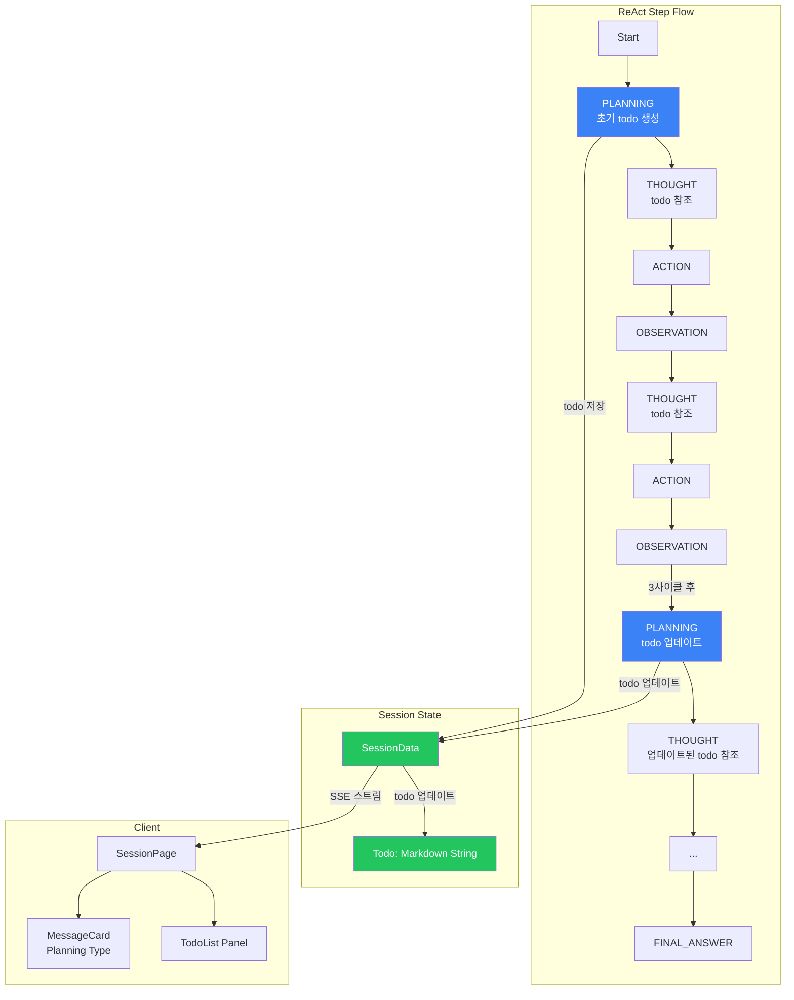

# ADR: Planning Step 도입 및 Todo 기반 작업 관리

## Status
✅ **Accepted & Implemented**

## Context

### 문제점
기존 ReAct 프레임워크는 각 사이클마다 즉시적인 액션만 계획하는 방식으로, 전체 작업의 큰 그림을 파악하기 어려웠습니다:

**구체적 문제:**
- 복잡한 작업에서 전체 진행 상황 파악 어려움
- 작업 단계들이 어떻게 연결되는지 명확하지 않음
- 중간에 방향을 잃거나 중복 작업을 수행할 가능성
- 진행 상황을 시각적으로 추적하기 어려움

### 요구사항
- 전체 작업을 구조화된 todo list로 관리
- 초기 계획 수립 및 주기적 재검토
- Todo를 Session에 저장하여 실시간 추적 가능
- Client에서 todo list를 시각적으로 표시

## Decision

**Planning Step을 ReAct 사이클에 통합**하여 작업을 체계적으로 관리합니다.

### 핵심 설계 결정

#### 1. Planning Step 타입 추가
- `ReActStepType.PLANNING` 추가
- 독립적인 step 타입으로 관리 (THOUGHT와 분리)

#### 2. Todo 저장 방식
- **Markdown string 형식**: `SessionData.todo`에 저장
- List 자료구조 대신 markdown 사용 (표시와 저장이 동일 형식)
- Planning step마다 todo 업데이트

#### 3. Planning 실행 시점
- **초기 Planning**: 첫 step으로 항상 실행
- **주기적 Planning**: N사이클마다 실행 (기본값: 3사이클, `REACT_PLANNING_INTERVAL`로 설정 가능)

#### 4. THOUGHT Step 변경
- `original_query` 대신 `todo`를 참조
- Planning step이 항상 첫 step이므로 fallback 불필요

### 아키텍처



## Implementation

### 1. Backend 구현

#### 1.1 State 관리 (`server/core/react/state.py`)
```python
class ReActStepType(Enum):
    PLANNING = "planning"  # 추가
    THOUGHT = "thought"
    ACTION = "action"
    OBSERVATION = "observation"
    FINAL_ANSWER = "final_answer"

@dataclass
class ReActStep:
    step_type: ReActStepType
    content: str
    todo: Optional[str] = None  # Planning step에서만 사용

class ReActState(BaseModel):
    def add_planning(self, content: str, todo: Optional[str] = None):
        """Planning step 추가"""
    
    def get_current_todo(self) -> Optional[str]:
        """가장 최근 planning step의 todo 반환"""
```

#### 1.2 Planning 프롬프트 (`server/core/react/prompts.py`)
```python
PLANNING_PROMPT = """**Original Query:** {original_query}

**Task:**
{task_instruction}

**Current Progress:**
{history_summary}

**Todo Planning:**
Provide a structured todo list in markdown format:
```markdown
- [x] Task 1: Description (completed)
- [ ] Task 2: Description
    - [ ] Task 2.1: Description
- [ ] Task 3: Description
```

**Planning:**"""

# 초기 planning
task_instruction = (
    "Create a comprehensive todo list breaking down the task into manageable steps. "
    "Adjust detail level based on query complexity (simple = concise, complex = detailed with subtasks). "
    "Focus on structuring the approach and identifying key milestones."
)

# 주기적 planning
task_instruction = (
    "Review and update the todo list based on progress so far. "
    "Concisely summarize tasks that are already completed or clearly in the past. "
    "Mark completed tasks and adjust remaining tasks if needed."
)
```

#### 1.3 THOUGHT 프롬프트 변경
```python
THOUGHT_PROMPT = """**Current Todo List:**
{todo}

**Task:**
1.  Review the todo list above and determine which task you should work on next.
2.  Analyze the current progress and formulate a concise plan for your next immediate action.
3.  Provide ONLY your thought process. Do not include the action itself.
...
"""
```

#### 1.4 Engine 로직 (`server/core/react/engine.py`)
```python
def _determine_next_step(self, state: ReActState) -> ReActStepType:
    if not state.steps:
        return ReActStepType.PLANNING  # 첫 step은 planning
    
    last_step = state.get_last_step()
    
    if last_step.step_type == ReActStepType.PLANNING:
        return ReActStepType.THOUGHT
    elif last_step.step_type == ReActStepType.OBSERVATION:
        if self._should_do_planning(state):
            return ReActStepType.PLANNING
        # ...
```

#### 1.5 Session 연동 (`server/services/session/`)
```python
@dataclass
class SessionData:
    todo: Optional[str] = None  # Markdown string

@dataclass
class SessionEvent:
    todo: Optional[str] = None  # Planning events

# SessionManager.add_event()에서 planning event 처리
if event.get("type") == "planning" and event.get("todo"):
    session.todo = event.get("todo")
```

### 2. Client 구현

#### 2.1 타입 정의
```typescript
export interface Message {
  type: 'planning' | 'thought' | ...  // planning 추가
}

export interface MessageMetadata {
  todo?: string  // Planning step의 todo markdown
}
```

#### 2.2 Planning MessageCard
- Planning 전용 스타일 (파란색 테마)
- Planning 내용과 todo list를 markdown으로 렌더링
- Todo 체크박스 스타일링

#### 2.3 TodoList 컴포넌트
- SessionPage 상단에 배치
- 접기/펼치기 기능
- 실시간 todo 업데이트 표시

#### 2.4 useSession 연동
```typescript
const currentTodo = ref<string | null>(null)

function handleStreamEvent(data: StreamEventData) {
  if (data.type === 'planning') {
    addMessage('planning', data.content || '', {
      todo: data.todo
    })
    
    if (data.todo) {
      currentTodo.value = data.todo
    }
  }
}
```

### 3. Configuration

```python
# server/core/utils/config.py
react_planning_interval: int = Field(default=3, alias="REACT_PLANNING_INTERVAL")
```

`.env` 파일에서 설정 가능:
```env
REACT_PLANNING_INTERVAL=3
```

## Consequences

### 장점

#### 1. 작업 추적성 향상
- ✅ 전체 작업을 구조화된 todo list로 관리
- ✅ 진행 상황을 시각적으로 추적 가능
- ✅ Client에서 실시간 todo list 확인 가능

#### 2. 작업 효율성 개선
- ✅ 초기 계획 수립으로 전체 그림 파악
- ✅ 주기적 재검토로 방향 수정 가능
- ✅ 중복 작업 방지

#### 3. 사용자 경험 향상
- ✅ SessionPage에서 todo list를 한눈에 확인
- ✅ Planning step을 메시지로 확인 가능
- ✅ 진행 상황 파악 용이

#### 4. 확장성
- ✅ Planning step을 독립적으로 관리
- ✅ 향후 다양한 planning 전략 추가 가능
- ✅ Todo 형식 변경에 유연하게 대응

### 단점

#### 1. 추가 LLM 호출
- ⚠️ Planning step마다 LLM 호출 발생
- ⚠️ 비용 및 시간 증가 (초기 + 주기적 planning)
- ⚠️ 완화: planning interval 조정 가능

#### 2. 복잡도 증가
- ⚠️ Step 타입 추가로 코드 복잡도 증가
- ⚠️ 완화: 명확한 구조 분리로 유지보수성 유지

### Trade-offs

#### Planning Step 통합 vs THOUGHT 통합
**선택: Planning Step 통합**
- ✅ 관심사 분리 (Planning vs Thought)
- ✅ 명확한 데이터 구조 (todo 별도 관리)
- ✅ 확장성 및 유지보수성 향상
- ⚠️ 코드 변경 범위 증가 (수용 가능)

#### Todo 저장 방식: Markdown String vs List
**선택: Markdown String**
- ✅ 저장과 표시 형식 일치
- ✅ Client에서 바로 렌더링 가능
- ✅ 형식 변경에 유연
- ⚠️ 구조화된 데이터 접근 제한 (필요시 파싱)

#### Planning Interval: 고정 vs 동적
**선택: 고정 Interval (설정 가능)**
- ✅ 간단한 구현
- ✅ 예측 가능한 동작
- ✅ Config로 조정 가능
- ⚠️ 상황에 따른 동적 조정 불가 (향후 개선 가능)

## Alternatives Considered

### 1. THOUGHT Step에 Planning 통합
**거부 이유:**
- THOUGHT의 역할이 복잡해짐
- Todo 추출 및 관리 어려움
- 명확한 관심사 분리 불가

### 2. Todo를 List 자료구조로 저장
**거부 이유:**
- Client에서 표시 시 변환 필요
- Markdown과의 불일치
- 복잡도 증가

### 3. Planning을 조건부로만 실행
**거부 이유:**
- 초기 planning이 항상 필요
- 복잡한 조건 로직 필요
- 예측 불가능한 동작

## Implementation Timeline

1. ✅ Backend: Planning step 타입 및 로직 구현
2. ✅ Backend: Todo 저장 및 Session 연동
3. ✅ Backend: THOUGHT 프롬프트 변경
4. ✅ Client: Planning MessageCard 구현
5. ✅ Client: TodoList 컴포넌트 구현
6. ✅ Client: SessionPage 통합

## References

- [Planning Step Implementation Plan](./planning_step_implementation_plan.md)
- [Planning Step Options Comparison](./planning_step_options.md)
- [Thought Prompt Redesign Plan](./thought_prompt_redesign_plan.md)
- [ReAct Step Architecture](./react_step_architecture.md)
- [Client Planning Implementation Plan](./client_planning_implementation_plan.md)

## Notes

- Planning interval은 실험적으로 조정 가능 (`REACT_PLANNING_INTERVAL`)
- Todo 형식은 markdown이지만, 향후 구조화된 형식으로 확장 가능
- Planning step에서 todo 추출 실패 시에도 프롬프트는 계속 진행 (안전장치)

