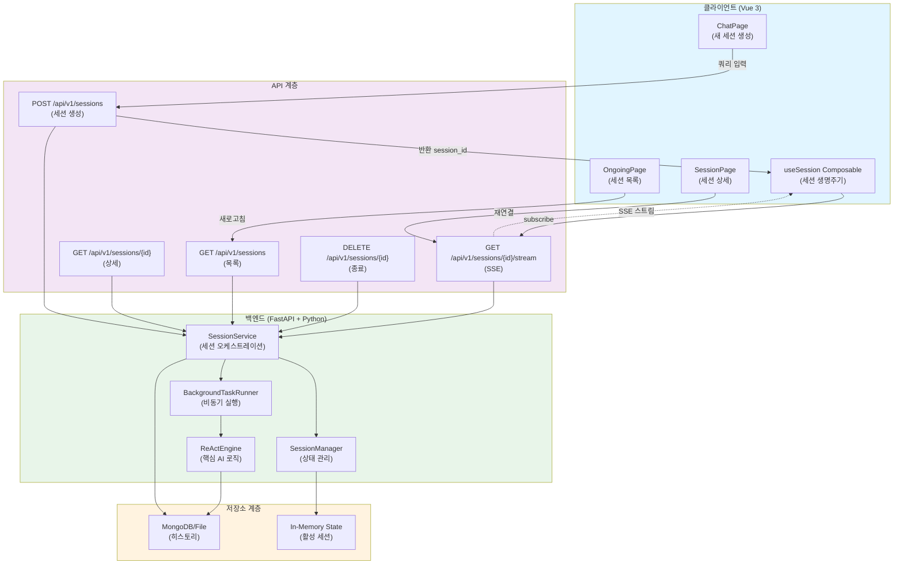
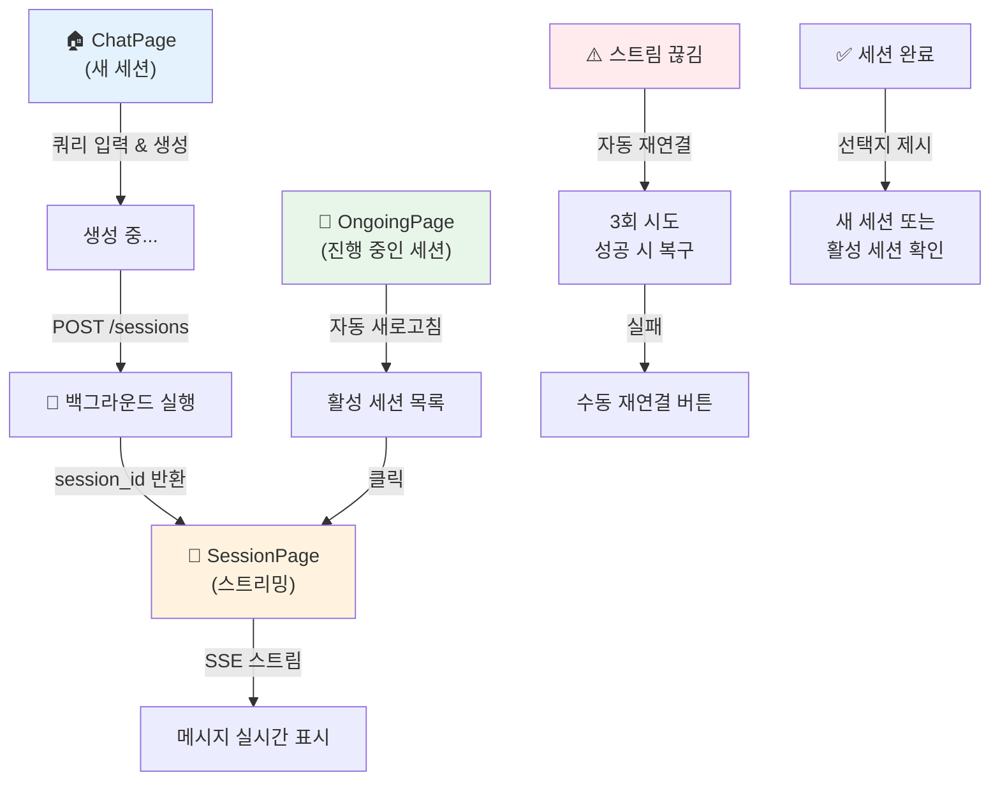

# ADR: 스트리밍 세션과 백그라운드 작업 분리 아키텍처 도입

## Status
✅ **Accepted & Implemented**

## Context

### 문제점
기존 시스템에서는 클라이언트의 스트리밍 연결과 서버의 작업 실행이 강하게 결합되어 있었습니다:

```
클라이언트 스트림 끊김 → 서버 작업 종료
```

**구체적 문제:**
- 네트워크 불안정으로 스트림 연결 끊김 → 백그라운드 작업 중단
- 서버 부하로 응답 지연 → 클라이언트 타임아웃 → 작업 손실
- 클라이언트 새로고침 → 진행 중인 작업 모두 손실
- 모바일 네트워크 전환 → 작업 재시작 필요

### 비즈니스 요구사항
- 대시보드에서 진행 중인 작업 실시간 모니터링
- 네트워크 끊김 후 쉬운 재연결
- 모바일에서의 안정적인 세션 관리
- 진행 중인 작업의 복구 가능성

## Decision

세션(백그라운드 작업)과 스트림(실시간 구독)을 **완전히 분리**하는 아키텍처를 도입합니다.

### 핵심 아키텍처



### 1. 백엔드 아키텍처

#### SessionManager - 세션 상태 관리
```python
# 세션 생명주기
Session State: CREATED → RUNNING → COMPLETED/FAILED
  ├── CREATED: 초기 생성 후 비동기 작업 스케줄링
  ├── RUNNING: 백그라운드 실행 중 (SessionManager가 상태 추적)
  └── COMPLETED/FAILED: SessionManager.cleanup_session() 시 히스토리에 저장
```

**책임:**
- 세션 메타데이터 관리
- 상태 추적 (created_at, completed_at, event_count)
- 이벤트 스트림 버퍼링
- 재연결 시 이벤트 재전송
- 세션 완료 시 히스토리 저장 및 메모리 정리

#### BackgroundTaskRunner - 독립적 작업 실행
```python
# 세션별 비동기 태스크 실행
asyncio.create_task(solve_in_background(session_id, query, model))
  ├── SessionManager.update_session_status(..., RUNNING)
  ├── AIAgent.solve_stream(...) 이벤트 수신
  ├── SessionManager.add_event(...)으로 스트리밍
  ├── 종료 이벤트 추가 및 상태 COMPLETED 전환
  └── SessionManager.cleanup_session(...)으로 히스토리에 저장
```

**특징:**
- API 응답성과 무관하게 계속 실행 (클라이언트 연결과 분리)
- 네트워크 연결 끊김 무시
- 작업 진행 상황을 SessionManager에 저장 후 SSE 구독자에게 전달
- 스트림 구독자가 없어도 계속 실행
- 현재 구현은 전용 워커 큐 대신 `asyncio` 태스크 기반 (독립 워커 풀은 향후 과제)

#### SessionService - 오케스트레이션
```python
# 비즈니스 로직 레이어
start_session()
  ├── SessionManager.create_session(...)
  ├── asyncio.create_task(BackgroundTaskRunner.solve_in_background(...))
  └── SessionData 반환 (session_id 포함)

subscribe_to_session(session_id)
  └── SessionManager.subscribe_to_session(...) 위임 (활성 세션만 지원)

get_session(session_id)
  └── 현재는 메모리 내 활성 세션만 반환 (히스토리 fallback TODO)
```

### 2. API 엔드포인트 설계

| 메서드 | 엔드포인트 | 역할 |
|--------|----------|------|
| POST | `/api/v1/sessions` | 새 세션 생성 → 백그라운드 asyncio 태스크 시작 |
| GET | `/api/v1/sessions` | 활성 세션 목록 (메모리에 존재하는 세션만) |
| GET | `/api/v1/sessions/{id}` | 활성 세션 상태 조회 (완료된 세션은 `/api/v1/history/{id}` 이용) |
| GET | `/api/v1/sessions/{id}/stream` | 활성 세션 SSE 스트림 (이전 이벤트부터 재전송, 완료 시 스트림 종료) |
| DELETE | `/api/v1/sessions/{id}` | 활성 세션 종료 및 정리 |

**핵심 특징:**
- `POST /sessions`: **블로킹 없음** → 즉시 session_id 반환
- `GET /sessions/{id}/stream`: 활성 세션 동안 재연결 시 이전 이벤트부터 재전송
- 완료된 세션 조회/스트리밍은 `/api/v1/history` 계열 엔드포인트 사용 (향후 통합 예정)

### 3. 프론트엔드 아키텍처

#### useSession Composable - 세션 생명주기 관리
```typescript
// 세션 상태 머신
State Transitions:
  IDLE → CREATE_SESSION → SUBSCRIBE_STREAM → STREAMING
    ├── 재연결 시: STREAMING (자동으로 최대 3회)
    ├── 스트림 종료: COMPLETED
    └── 오류 시: ERROR → 수동 재연결 옵션
```

**핵심 기능:**
```typescript
createSession()
  └─ POST /api/v1/sessions 
     └─ subscribeToStream()

subscribeToStream()
  └─ EventSource /api/v1/sessions/{id}/stream
     ├─ onopen: 연결 성공
     ├─ onmessage: 이벤트 수신 및 메시지 업데이트
     └─ onerror: 자동 재연결 시도

reconnect()
  └─ 기존 session_id로 subscribeToStream() 재실행
     (최대 3회, 2초 간격)
```

#### 페이지 흐름



## Consequences

### ✅ 긍정적 결과

1. **복원력 향상**
   - 스트림 끊김 → 세션 계속 실행 (손실 없음)
   - 재연결 시 이전 상태부터 복구
   - 모바일 네트워크 전환 견딜 수 있음

2. **확장성 개선**
   - 스트림 구독자 수와 무관하게 작업 실행
   - 여러 클라이언트가 같은 세션 구독 가능
  - 세션별 비동기 태스크로 병렬 실행 가능

3. **사용자 경험 향상**
   - 진행 중인 작업 목록 실시간 확인
   - 끊긴 세션 쉽게 복구
   - 작업 손실 방지

4. **관찰성 개선**
   - 모든 세션의 이벤트 영구 저장
   - 완료된 세션 재생 가능
   - 디버깅과 감시 용이

### ⚠️ 트레이드오프

1. **메모리 사용**
   - 활성 세션별 이벤트 버퍼 유지
   - **완화책**: 이벤트 버퍼 크기 제한, 주기적 히스토리 전환

2. **복잡도 증가**
   - 세션, 스트림, 히스토리 3가지 상태 관리
   - **완화책**: SessionService로 일관된 인터페이스 제공

3. **네트워크 비용**
   - 자동 새로고침으로 폴링 증가 가능
   - **완화책**: 클라이언트에서 새로고침 간격 조정 가능

## Alternatives

### 1️⃣ 기존 방식 유지 (제거됨)
- 스트림과 작업 직접 결합
- **문제**: 스트림 끊김 = 작업 종료
- **선택 안 함**: 복원력 부족

### 2️⃣ 워커 큐만 사용 (Celery 등)
- 모든 작업을 외부 큐 시스템으로 이관
- **장점**: 높은 확장성
- **단점**: 외부 의존성 증가, 운영 복잡도
- **선택 안 함**: 현재 규모에서 오버엔지니어링

### 3️⃣ 웹소켓 기반 양방향 통신
- 스트림 대신 WebSocket 사용
- **장점**: 양방향 통신
- **단점**: 연결 유지 비용, 브라우저 호환성
- **선택 안 함**: SSE로 충분하고 더 간단함

**선택한 방식:** 2+3의 장점 결합
- BackgroundTaskRunner로 작업 독립성 확보 (확장성)
- SSE로 간단한 스트리밍 (단순성)

## Implementation Details

### 백엔드 레이어 구성 (✅ 구현 완료)
```
server/
├── main.py                          (14개 API 엔드포인트)
├── services/
│   ├── __init__.py
│   └── session/                     (✅ 세션 서비스 모듈)
│       ├── __init__.py
│       ├── service.py               (✅ SessionService)
│       ├── manager.py               (✅ SessionManager)
│       ├── runner.py                (✅ BackgroundTaskRunner)
│       └── models.py                (✅ SessionData, SessionStatus, SessionEvent)
├── core/
│   ├── agent/
│   │   └── react_agent.py           (AI 로직)
│   └── ...
└── repositories/
    └── mongo_repository.py          (히스토리 저장)
```

### 구조 설계 원칙
- **Service 계층에 세션 관리 통합**: 비즈니스 로직이므로 core가 아닌 service 레이어에서 관리
- **모듈식 구조**: `server/services/session/` 서브디렉토리로 session 관련 코드 집중
- **확장성**: 향후 다른 service 추가 시 (notification, analytics 등) 같은 패턴으로 확장 가능

### 주요 개선사항
1. **패키지 구조 개선**
   - 기존: `server/services/session_service.py` (단일 파일)
   - 개선: `server/services/session/` (모듈화된 디렉토리)

2. **의존성 관리**
   - SessionService는 SessionManager와 BackgroundTaskRunner를 composition으로 포함
   - main.py는 SessionService만 import

3. **테스트 용이성**
   - 각 컴포넌트를 독립적으로 테스트 가능
   - Mock 객체 주입이 명확함

### 프론트엔드 레이어 구성
```
client/src/
├── composables/
│   └── useSession.ts                (세션 생명주기)
├── components/
│   ├── SessionControl.vue           (연결 상태 제어)
│   └── ...
├── pages/
│   ├── ChatPage.vue                 (새 세션)
│   ├── OngoingPage.vue              (활성 세션 목록)
│   ├── SessionPage.vue              (세션 상세)
│   └── HistoryPage.vue              (완료 세션)
└── router/
    └── index.ts                     (라우팅)
```

## Migration Path

### Phase 1: 기본 구현 ✅ 완료 (2025-10-26)
- ✅ SessionManager, BackgroundTaskRunner 구현
- ✅ 14개 API 엔드포인트 추가
- ✅ useSession Composable 구현 (프론트엔드)
- ✅ OngoingPage, SessionPage 추가 (프론트엔드)
- ✅ 세션 모듈화: `server/services/session/` 구조 도입
  - SessionService (오케스트레이션)
  - SessionManager (상태 관리)
  - BackgroundTaskRunner (독립 실행)
  - Models (데이터 구조)

### Phase 2: 최적화 (권장)
- [ ] 세션 조회 시 히스토리 fallback 구현 (`/api/v1/sessions/{id}` → history 자동 조회)
- [ ] 이벤트 버퍼 크기 제한 (설정 가능)
- [ ] 세션 타임아웃 정책 (자동 정리)
- [ ] 메트릭 수집 (Prometheus)
- [ ] 에러 처리 및 복구 전략 개선

### Phase 3: 고급 기능 (미래)
- [ ] 다중 사용자 세션 공유
- [ ] 세션 일시정지/재개
- [ ] 우선순위 큐 (Celery 전환)
- [ ] 분산 세션 저장소 (Redis)

## References

- **스트리밍 아키텍처**: Server-Sent Events (SSE) RFC 6202
- **비동기 패턴**: Python asyncio, threading
- **상태 머신**: Session Lifecycle Management
- **API 설계**: RESTful API Best Practices

## Questions & Decisions Log

**Q: 왜 외부 큐 시스템(Celery)을 쓰지 않나?**
A: 현재 규모에서는 `asyncio` 기반 비동기 태스크로 충분하고, 운영 복잡도를 낮추기 위해

**Q: SSE가 연결을 잃으면 어떻게 되나?**
A: EventSource 클라이언트에서 자동 재연결 시도 (최대 3회), 실패 시 수동 재연결 버튼

**Q: 세션 ID는 어떻게 관리되나?**
A: 타임스탐프 기반 (`chat_YYYYMMDD_HHMMSS`) + 진행 중인 세션은 메모리에, 완료된 세션은 MongoDB/File에 저장

---

**Last Updated**: 2025-10-31 (asyncio 기반 세션 실행 및 API 현황 반영)
**Version**: 1.2.0
