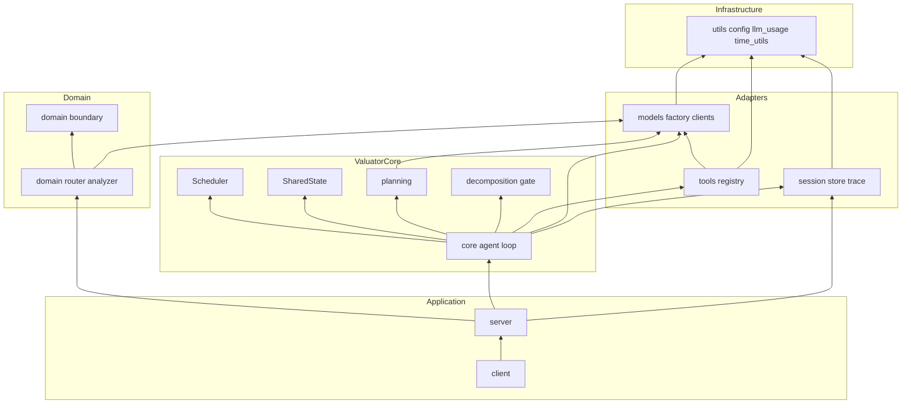
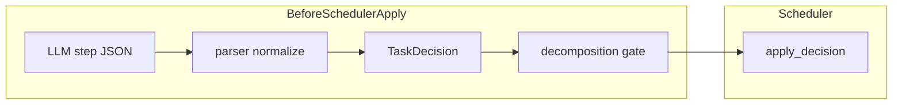

# PR: Task-Aware Recursive Agent 리팩토링 및 경계 정리

GitHub PR 본문으로 복사해 쓸 수 있는 초안입니다.

---

## 한눈에 보기

- **무엇**: 재귀 에이전트 코어를 Task-Aware 구조로 정리하고, 스케줄러·파서·세션·모델·툴 레이어를 분리한다.
- **왜**: 스케줄러에 섞였던 fact 대기·God 모듈·LLM JSON 불일치로 인한 `step_invalid`/교착 비용을 줄인다.
- **스펙**: [TS-003](adr/tech-spec/TS-003-task-aware-recursive-agent.md), [TS-004](adr/tech-spec/TS-004-mcts-decomposition-gate.md), [remove-fact-wait](adr/remove-fact-wait.md), [agent-step-decision-protocol](agent-step-decision-protocol.md) — 원칙은 [CLAUDE.md](../CLAUDE.md).
- **구조 그림**: [Architecture](#architecture) 섹션(레이어·한 step 시퀀스·게이트 위치·대기 모델).
- **MCTS와의 관계**: [MCTS-inspired vs 전체 MCTS](#mcts-inspired-ts-004) — **영감만 차용, 몬테카를로 트리 서치 전체 구현 아님**.

### 이 문서 읽는 순서

1. **한눈에 보기** → 전체 의도  
2. **[Summary](#summary)** → 문제·해결·범위  
3. **[Architecture](#architecture)** → 시스템 관점(레이어·흐름·경계·**MCTS-inspired 게이트**)  
4. **[What Changed](#what-changed)** → 모듈·파일 단위 변경 (Architecture와 대응)  
5. **결정·스펙 정합·이전·리스크·테스트** → 리뷰·릴리즈 체크용  

---

## 제목 후보

1. `feat(core): Task-Aware Recursive Agent 구조 정리, fact-wait 제거, 패키지 레이어 분리`
2. `refactor(valuator): Agent/Scheduler/Planning 경계 강화 및 session·models·tools 정리`
3. `chore: decomposition gate·parser 정규화·OpenRouter·도메인 경계 연동`

---

## Summary

### 배경

정적 DAG·고정 파이프라인으로는 “실행 중 분해·중간 집계·형제 간 가정 공유”를 표현하기 어렵다는 문제가 있었다. 이를 **Task-Aware Composite + Scheduler + SharedState**로 풀고([TS-003](adr/tech-spec/TS-003-task-aware-recursive-agent.md)), LLM은 매 step 하나의 `TaskDecision`만 제안하고 런타임이 전이를 적용한다.

### 문제 → 이번 PR의 방향

| 문제 | 방향 |
|------|------|
| 스케줄러가 fact key 의미까지 해석해 readiness와 섞임 | fact 구독 기반 대기 제거, **task id 의존**만 유지 ([remove-fact-wait](adr/remove-fact-wait.md)) |
| LLM JSON과 이산 액션 불일치 → `step_invalid`·재시도 | **parser 경계에서 정규화 1회** + 매핑 ([agent-step-decision-protocol](agent-step-decision-protocol.md)) |
| `DECOMPOSE` 즉시 적용 → 과잉 분해 비용 | **apply 전 gate** + (선택) critic + **AGGREGATE 시** outcome ([TS-004](adr/tech-spec/TS-004-mcts-decomposition-gate.md)) |
| God 모듈·레이어 역전 | `session` / `runtime` / `utils` 분리, `TOOL_SPECS` 단일 소스 ([valuator_package_refactoring_draft.plan](valuator_package_refactoring_draft.plan.md)) |

### 이번 PR에서 한 일 (요지)

1. **스케줄링과 데이터 공유 분리**  
   `wait_for_facts` 및 fact 구독 기반 readiness를 제거해, 스케줄러가 fact key 의미를 해석하지 않게 했다([remove-fact-wait](adr/remove-fact-wait.md)). 대기는 **`wait_for`(task id)** 중심.

2. **LLM 출력은 경계에서만 정규화**  
   `StepIntentPayload`·`normalize_decision_raw` 등으로 **한 번** 정리한 뒤 `TaskDecision`으로 옮겨 `step_invalid`/연쇄 재시도를 줄였다([agent-step-decision-protocol](agent-step-decision-protocol.md), [CLAUDE.md](../CLAUDE.md)).

3. **과잉 분해 비용 억제 (MCTS-inspired)**  
   [TS-004](adr/tech-spec/TS-004-mcts-decomposition-gate.md)는 **전통적 MCTS 전체**(UCT·rollout 트리)가 아니라, **selection**(분해 확정 전 게이트)과 **backpropagation**(`AGGREGATE` 이후 threshold 학습)만 차용한다. 구현은 `valuator/core/decomposition/` (gate / critic / tracker)에 모았다. 상세는 [Architecture § MCTS-inspired](#mcts-inspired-ts-004).

4. **패키지·인프라 정리**  
   session·runtime·llm_usage·time_utils 경로 재배치, `TOOL_SPECS` 단일 소스, LLM 팩토리(OpenRouter/Gemini) 정리([valuator_package_refactoring_draft.plan](valuator_package_refactoring_draft.plan.md)).

### 범위 밖 (의도적으로 미포함)

- **전체 몬테카를로 트리 탐색(MCTS)** — 시뮬레이션 rollout·UCT로 탐색 트리를 도는 구현은 하지 않음 ([TS-004](adr/tech-spec/TS-004-mcts-decomposition-gate.md) Non-Goal: “전체 MCTS rollout”). 세션 간 threshold 영속도 동일 스펙에서 제외.  
- Context window 예산·deterministic shortcut 전부 ([TS-003](adr/tech-spec/TS-003-task-aware-recursive-agent.md) Part 4는 후속)  
- `logs/` 대량 정리·서브모듈 포인터만 바꾸는 것 — **기능 PR과 분리** 권장  

---

## Architecture

PR을 “코드 변경 목록”이 아니라 **시스템 구조**로 읽을 때의 기준점이다. 아래 [What Changed](#what-changed)의 모듈명은 이 절의 그림과 대응한다. 상세 근거는 [TS-003](adr/tech-spec/TS-003-task-aware-recursive-agent.md)과 [CLAUDE.md](../CLAUDE.md)에 있다.

### 관심사 분리 (3축)

Task-Aware 재귀 에이전트는 아래 세 축으로 나뉜다. **한 모듈이 둘 이상을 동시에 소유하지 않도록** 이번 PR에서 경계를 정리했다.

| 축 | 책임 | 대표 코드 |
|----|------|-----------|
| **의미** — 무엇을 할지 | 태스크 설명·`TaskDecision` 제안 | `Task`, `StepPlanner`, LLM 호출 |
| **실행** — 언제·어떤 순서 | READY 큐·의존성·동시성·교착 복구 | `Scheduler` |
| **정합성** — 공유 가정·충돌 | fact publish·conflict 기록(읽기는 context) | `SharedState` |

스케줄러는 **태스크 ID와 의존 그래프**만 본다. fact key 문자열로 “누가 READY인지”를 결정하는 경로는 제거했다([remove-fact-wait](adr/remove-fact-wait.md)).

### 논리 레이어와 의존 방향

애플리케이션·도메인·에이전트 코어·인프라의 **의존성은 안쪽(도메인/코어)으로 향**하고, `utils`는 leaf에 가깝게 둔다([valuator_package_refactoring_draft.plan](valuator_package_refactoring_draft.plan.md)).



세션 저장소는 `Task` 등 **코어 타입**에 의존한다(`valuator/session/store.py`). 다이어그램의 `Agent → Session`은 런타임이 트리·트레이스를 기록하는 방향이다.

`valuator/runtime.py`는 툴 레지스트리 조립·최종 출력 문자열화 등 **진입점 근처 오케스트레이션**을 모은다.

### 런타임: 한 step의 데이터 흐름

한 READY 태스크에 대해, 제안 → (게이트) → 적용 → (도구 또는 상태 전이)까지의 상위 흐름이다.

```mermaid
sequenceDiagram
  participant Loop as AgentLoop
  participant Ctx as ContextBuilder
  participant Planner as StepPlanner
  participant Parser as ParserBoundary
  participant Gate as DecompositionGate
  participant Sched as Scheduler
  participant SS as SharedState
  participant Reg as ToolRegistry

  Loop->>Ctx: build TaskContext
  Loop->>Planner: LLM step JSON schema
  Planner->>Parser: raw JSON
  Parser-->>Loop: TaskDecision
  alt action is DECOMPOSE
    Loop->>Gate: static filter optional critic
    Gate-->>Loop: allow or requery
  end
  Loop->>Sched: apply_decision
  alt action is EXECUTE
    Loop->>Reg: execute tool
    Reg-->>Loop: ToolResult
  end
  alt action is AGGREGATE or FINALIZE
    Loop->>SS: publish facts optional
  end
```

`concurrency`는 **동시에 RUNNING일 수 있는 태스크 수 상한**이지, 교착의 근본 원인이 아니다([agent-step-decision-protocol](agent-step-decision-protocol.md)).

### 경계 (CLAUDE.md)

| 경계에서 할 일 | 이 PR에서의 위치 |
|----------------|------------------|
| HTTP/세션 페이로드 → 도메인 타입 | `server`, `domain` |
| LLM JSON → `TaskDecision` | `planning/parser` — `normalize` **1회** 후 Pydantic |
| 외부 LLM 응답 → `TokenUsage` 등 | `models/gemini_direct`, `models/openrouter` |
| 원시 티커/SEC miss 등 | `domain/boundary` |

경계를 통과한 뒤 비즈니스 로직에서 `ensure`/`validate`/`normalize`를 반복하지 않는다 — [CLAUDE.md](../CLAUDE.md).

### Decomposition gate의 아키텍처적 위치 (TS-004)

`Scheduler.apply_decision(DECOMPOSE)`가 호출되는 순간 **자식 생성 비용은 이미 커밋**된다. 따라서 “과잉 분해를 막는 장치”는 **스케줄러 뒤가 아니라 Agent 쪽, apply 직전**에 둔다([TS-004](adr/tech-spec/TS-004-mcts-decomposition-gate.md)).



`AGGREGATE` 이후의 outcome 평가는 **게이트를 대체하지 않고**, threshold 학습 등 **사후 신호**로만 쓴다.

<a id="mcts-inspired-ts-004"></a>

### MCTS에서 차용한 것과 하지 않는 것 (TS-004)

[TS-004](adr/tech-spec/TS-004-mcts-decomposition-gate.md) 제목의 **MCTS-inspired**는, **몬테카를로 트리 탐색(MCTS) 전체 파이프라인**(선택·확장·다회 시뮬레이션·역전파를 한 트리 위에서 반복)을 구현한 것이 **아니다**. 여기서 가져온 것은 **selection**(확장 전에 가지를 걸러냄)과 **backpropagation**(실행 결과로 기준을 갱신) **두 아이디어뿐**이다.

| MCTS 쪽 개념 | 이 PR·코드베이스에서의 대응 |
|--------------|---------------------------|
| **Selection** | `DECOMPOSE`가 스케줄러에 닿기 **전** — Layer 1 static pre-filter, gray zone이면 Layer 2 critic. **자식 노드(태스크)를 만들기 전**에 비용을 차단. |
| **Expansion** | 게이트를 통과한 경우에만 `Scheduler.apply_decision`으로 자식 생성. |
| **Simulation / rollout** | **없음.** 별도의 가상 rollout 트리를 돌지 않고, **실제 에이전트 실행**이 관측이다. |
| **Backpropagation** | Layer 3 — `AGGREGATE` 시점에 **실제 분해 효율** 등을 보고 threshold 등을 조정 ([TS-004 §2–3](adr/tech-spec/TS-004-mcts-decomposition-gate.md)). |

**TS-004가 명시한 Non-Goal (요지)**

- 전체 MCTS rollout  
- 세션 간 threshold 지속  
- `EXECUTE`·`WAIT` 등 다른 액션에 대한 동일 게이트  
- `AGGREGATE` 시점에 **추가 LLM critic**을 붙이는 것  

정리하면, **UCB/UCT로 탐색 트리를 여러 번 시뮬레이션하는 “몬테카를로 트리 서치” 본체는 포함되지 않고**, **과잉 분해 한 종류의 비용**에 맞춘 **경량 selection + 사후 backprop**이다.

### 대기 모델: fact-wait 제거 이후

**이전 (제거)**: `WAIT` + `wait_for_facts` → Scheduler/SharedState가 fact key 구독으로 readiness를 섞어 관리 → 이중 인덱스·순환 불가능한 deadlock·도메인 개념이 스케줄러로 침투.

**이후 (현재)**: `WAIT`는 **`wait_for`(task id)** 만큼 **구조적 의존성**으로 표현. SharedState는 **publish / conflict / view**로 데이터 공유에 집중. 동적 조율이 필요하면 분해 시 `depends_on_siblings`·부모 재분해·다음 step에서 읽기로 흡수([remove-fact-wait](adr/remove-fact-wait.md)).

---

## What Changed

[Architecture](#architecture)의 **ValuatorCore / Adapters / Domain**에 맞춰 모듈별로 정리했다. “한 줄 요약” 표로 먼저 스캔하고, 아래에 **목적**만 덧붙였다.

| 축 | 한 줄 |
|----|--------|
| **Core** | `agent/` 분리, `scheduler`/`shared_state`/`types` — fact-wait 제거 |
| **Planning** | `planning/` — planner·parser·prompts, 경계 정규화 |
| **Decomposition** | `decomposition/` — gate·critic·controller([TS-004](adr/tech-spec/TS-004-mcts-decomposition-gate.md)) |
| **Session / Runtime** | `valuator/session/`, `valuator/runtime.py` |
| **Models / Tools** | `factory`, `gemini_direct`, `openrouter`, `protocol`; `specs.py` + `base.py` |
| **Domain / Server / Client** | boundary·query 분석, `server/main.py` Agent 연동, 클라이언트 모델·세션 UI |

### Core

| 목적 | 변경 요지 |
|------|-----------|
| 루프 가독성·테스트 용이 | `valuator/core/agent/` — 기존 단일 `agent.py`를 루프·트레이스·컨텍스트 빌더 등으로 분리. |
| 실행 순서만 스케줄러 | `scheduler.py` — 의존성·`break_deadlock`·동시 실행 상한. **fact subscription 기반 readiness 제거.** |
| 공유 데이터 vs 스케줄 | `shared_state.py` — publish·conflict 유지, **fact waiter 구독/드레인 제거.** |
| 도메인 불변식 전달 | `types.py` — `TaskDecision` frozen, `EventType`, `ToolResult` in core. **`wait_for_facts` 제거** → **`wait_for`만.** |
| 태스크·스케줄러 상태 | `task.py` — Atomic/Complex와 스케줄러가 다루는 가변 상태 정리. |

### Planning

| 목적 | 변경 요지 |
|------|-----------|
| planner·파싱·프롬프트 응집 | `valuator/core/planning/` — `StepPlanner`, `parser`, `prompts`, `actions` (구 `step_planner.py` 분해). |
| 경계 단일화 | `normalize_decision_raw` 등 **1회** 정규화 → Pydantic → `TaskDecision`. |
| `step_invalid` 완화 | `loop.py` — 무의미한 `WAIT`/`AGGREGATE` 보강 등. |

### Decomposition (TS-004, MCTS-inspired)

| 목적 | 변경 요지 |
|------|-----------|
| 자식 생성 전 비용 차단 | `valuator/core/decomposition/` — `gate`, `critic`, `controller`, `types`. |
| MCTS **아이디어만** (전체 MCTS 아님) | selection ≈ apply 전 게이트, backprop ≈ `AGGREGATE` 후 threshold — [§ MCTS-inspired](#mcts-inspired-ts-004). |
| 스펙과 동일한 역할 분리 | `DECOMPOSE`가 스케줄러에 닿기 **전** static / critic; 허용된 분해만 기록; `AGGREGATE`에서 threshold 보정. |
| 운영 튜닝 | `valuator/utils/config.py`, env `DECOMPOSITION_GATE_*` ([TS-004](adr/tech-spec/TS-004-mcts-decomposition-gate.md)). |

### Session · Runtime · Utils

| 목적 | 변경 요지 |
|------|-----------|
| 세션 I/O 한 곳 | `valuator/session/` — `ValuatorSessionStore`, `SessionTraceWriter` (구 `session_store` / `utils/session_trace`). |
| CLI·서버 공통 진입 | `valuator/runtime.py` — 구 `agent_runtime` (`create_tool_registry`, `finalize_trace`, `final_output_text`). |
| 공유 인프라 | `valuator/utils/llm_usage.py`, `time_utils.py` — 토큰·시간 측정 공통화. |

### Models

| 목적 | 변경 요지 |
|------|-----------|
| 모델 문자열 단일 해소 | `models/factory.py` — `create_llm_client`. |
| LLM 경계·사용량 추적 | `gemini_direct`, `openrouter`, `protocol` — UsageWriter, 경계에서 `TokenUsage` 생성 등. |

### Tools

| 목적 | 변경 요지 |
|------|-----------|
| 스키마 중복 제거 | `tools/specs.py` — **`TOOL_SPECS` 단일 소스** (스키마 + 오케스트레이션 메타). |
| 툴 클래스 단순화 | `tools/base.py` — 레거시 검증 제거, 스키마는 specs 위임. |
| 미사용 제거 | `context_tool.py` — **삭제**. |
| 런타임 등록 유지 | `yfinance_tool.py` — `runtime` 레지스트리에 유지, 스키마는 `TOOL_SPECS`와 정합. |

### Domain · Server · Client

| 목적 | 변경 요지 |
|------|-----------|
| 질의 분석·경계 확장 | `domain/` — `QueryAnalyzer` / `QueryAnalysis` 확장, `domain/boundary/` (예 SEC 티커 `sec_on_miss`). |
| Agent 런타임 조립 | `server/main.py` — `create_llm_client`, Agent·Scheduler·SharedState, 세션/트레이스, `asyncio.to_thread`로 I/O 블로킹 완화. |
| 부가 서비스 | `server/services/task_rewrite/` — LLM 클라이언트 경로 정리. |
| 프런트 정합 | `client/` — 모델 선택·세션·태스크 리라이트 UI (`InputSection`, `useSession`, `TaskRewritePage`, `modelOptions` 등). |

### Tests · Docs · 기타

| 항목 | 내용 |
|------|------|
| `tests/` | agent, scheduler, planner, gate/critic, session, parser, openrouter, domain 등 회귀·신규 확장. |
| `docs/` | ADR·tech spec·프로토콜·리팩터 플랜 보강. |
| `requirements.txt` | 예: `google-genai` 등 런타임 의존성. |

### 리뷰 시 참고: `logs/`

세션 트레이스·진단 파일 대량 변경은 **기능 diff와 분리**해 보는 것을 권장한다 (별 PR / `.gitignore` 정리 등).

---

## Architectural Decisions

아래는 [Architecture](#architecture)를 한 줄로 압축한 것이다. 리뷰 시 “왜 이렇게 나뉘었는지”만 빠르게 보려면 이 표를 쓰면 된다.

| 결정 | 이유 | 근거 문서 |
|------|------|-----------|
| Task-Aware `step()` + `Scheduler.apply_decision()` | 의미(태스크)와 실행(스케줄링) 분리, 동적 트리 | [TS-003](adr/tech-spec/TS-003-task-aware-recursive-agent.md) |
| `wait_for_facts` 제거 | 내용 기반 스케줄링·이중 추적·교착 위험 감소 | [remove-fact-wait](adr/remove-fact-wait.md) |
| LLM JSON 정규화는 parser 경계에서 1회 | `step_invalid` 완화, 내부 재검증 금지와 정합 | [agent-step-decision-protocol](agent-step-decision-protocol.md), [CLAUDE.md](../CLAUDE.md) |
| Decomposition gate는 자식 생성 전 | `DECOMPOSE` 적용 후에는 비용이 이미 커밋 | [TS-004](adr/tech-spec/TS-004-mcts-decomposition-gate.md) |
| **MCTS-inspired** = selection·사후 backprop만 | 전통 MCTS(UCT·다회 rollout 트리)는 구현 범위 밖 | [TS-004](adr/tech-spec/TS-004-mcts-decomposition-gate.md) Non-Goal |
| 레이어: core ↔ utils ↔ session ↔ models | God class·역방향 의존 완화 | [valuator_package_refactoring_draft.plan](valuator_package_refactoring_draft.plan.md) |

---

## Spec Alignment

스펙 문서와 **의도적으로 같거나 다르게 둔 것**만 구분해 적었다. 세부 알고리즘은 원문을 본다.

### TS-003

| 구분 | 내용 |
|------|------|
| **일치** | LLM-driven step, `TaskDecision` 액션, `Scheduler` + `SharedState`, 서버에서 Agent 실행. |
| **의도적 변경** | 초안의 **`wait_for_facts` / subscribe로 깨우기**는 제거. 대기는 **`wait_for`**. 동적 데이터가 더 필요하면 `depends_on_siblings`, 부모 `AGGREGATE` 후 재분해, 다음 step에서 SharedState 읽기 — [remove-fact-wait](adr/remove-fact-wait.md). |

### TS-004

| 구분 | 내용 |
|------|------|
| **일치** | static → (필요 시) critic → 허용 분해만 기록 → `AGGREGATE`에서 outcome 반영. |
| **MCTS 명칭** | **MCTS-inspired** = selection(게이트) + backprop(threshold)만 차용. **전체 몬테카를로 트리 서치**(rollout·UCT 트리 탐색)는 Non-Goal — [§ MCTS-inspired](#mcts-inspired-ts-004). |
| **구현 형태** | 스펙의 단일 `decomposition_*.py`가 아니라 **`core/decomposition/` 패키지**로 정리. |

---

## Migration / 호환성

### Import 경로

| 이전 (개념) | 이후 |
|-------------|------|
| `valuator.agent_runtime` | `valuator.runtime` |
| `valuator.session_store` | `valuator.session.store` |
| `valuator.utils.session_trace` | `valuator.session.trace` |
| `valuator.core.llm_usage` | `valuator.utils.llm_usage` |

직접 import 하는 스크립트·외부 도구는 위에 맞춰 수정한다.

### 환경 변수

gate·OpenRouter·모델 alias 등은 **`valuator/utils/config.py`**와 로컬 **`.env`**를 참고한다. (TS-004 예시: `DECOMPOSITION_GATE_*` — [TS-004 §7](adr/tech-spec/TS-004-mcts-decomposition-gate.md).)

### 동작 변경

- 예전에 **fact 문자열**로 태스크를 블로킹하던 흐름은 제거되었다.  
- `wait_for_facts`에 의존하던 시나리오는 **`wait_for`(task id)** 또는 **분해 시 의존성**으로 옮겨야 한다.

---

## Risks & Mitigations

| 리스크 | 완화 |
|--------|------|
| 스케줄러/파서 변경으로 **교착·`step_invalid`** | `break_deadlock`, parser 정규화, 루프 회복 + 테스트 ([agent-step-decision-protocol](agent-step-decision-protocol.md)). |
| **과잉/부족 분해** | TS-004 gate, 설정, `decomposition_gated` 이벤트·로그. |
| **세션 I/O·트레이스** | `asyncio.to_thread` 등, 장시간 실행 시 디스크 부하 주의 ([remove-fact-wait](adr/remove-fact-wait.md) 부수). |
| **경계 흐트러짐** | Pydantic·`domain/boundary`에서만 원시 입력 변환 ([CLAUDE.md](../CLAUDE.md)). |

---

## Test Plan

### 자동 (최소 게이트)

```bash
ruff check .
ruff format .
python -m pytest tests/
```

### 회귀 우선순위 (파일)

| 우선순위 | 영역 | 파일 |
|----------|------|------|
| P0 | 에이전트·게이트 | `tests/test_recursive_agent_run.py`, `tests/test_decomposition_gate.py`, `tests/test_decomposition_critic.py` |
| P0 | 스케줄러 | `tests/test_recursive_agent_scheduler.py` |
| P1 | 플래너·파서 | `tests/test_step_planner.py`, `tests/test_parser_normalize.py` |
| P1 | 세션 | `tests/test_session_trace.py`, `tests/test_session_store.py` |
| P1 | 모델·설정 | `tests/test_llm_factory.py`, `tests/test_openrouter_client.py`, `tests/test_config.py` |
| P2 | 도메인 | `tests/test_query_analysis_payload.py`, `tests/test_query_ticker_enrichment.py`, `tests/test_domain_tool.py` |

### 수동 체크리스트

1. `uvicorn server.main:app --reload` — 질의 1건, SSE·최종 결과.  
2. `python scripts/run_recursive_agent_query.py` — 로컬 `.env` 기준.  
3. `DECOMPOSITION_GATE_ENABLED` on/off 및 `DECOMPOSITION_GATE_*` — 분해 거부·재질의·`decomposition_gated`.  
4. 예전 `wait_for_facts` 시나리오 — `wait_for` 또는 분해 의존으로 동작 확인.  

---

## Follow-ups

| 분류 | 항목 |
|------|------|
| 명세 | 의도 스키마·런타임 전이 문서 고정 ([agent-step-decision-protocol](agent-step-decision-protocol.md) 체크리스트). |
| 비용·성능 | Context window / deterministic shortcuts ([TS-003](adr/tech-spec/TS-003-task-aware-recursive-agent.md) Part 4). |
| 구조 | Config 분할·DI. |
| 저장소 | `logs/`, Researcher-UI-Demo 서브모듈 — 별도 PR. |

---

## Related Documents

| 문서 | 역할 |
|------|------|
| [CLAUDE.md](../CLAUDE.md) | 경계·금지 패턴·명령 |
| [TS-003](adr/tech-spec/TS-003-task-aware-recursive-agent.md) | Task-Aware 아키텍처 |
| [TS-004](adr/tech-spec/TS-004-mcts-decomposition-gate.md) | MCTS-inspired decomposition gate (selection·backprop; 전체 MCTS 아님) |
| [remove-fact-wait](adr/remove-fact-wait.md) | fact-wait 제거 ADR |
| [agent-step-decision-protocol](agent-step-decision-protocol.md) | parser·교착·정규화 |
| [valuator_package_refactoring_draft.plan](valuator_package_refactoring_draft.plan.md) | 패키지 리팩터 플랜 |
