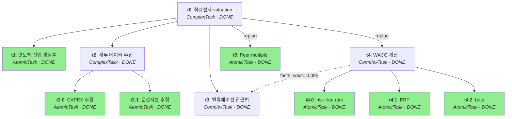
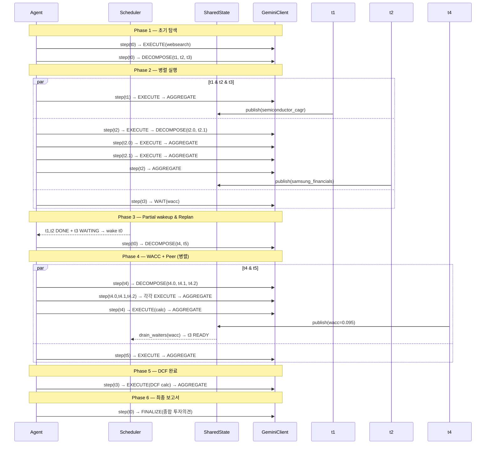

# TS-003: Task-Aware Recursive Agent Architecture

## Context

Valuator의 기존 `valuator/core/`(plan→execute→aggregate→review 파이프라인)는 commit 290d0d8에서 제거되었다. 제거 사유는 정적 DAG, 고정 파이프라인 단계, 공유 상태 부재로 인해 Valuation의 "가설→근거→수정" 순환을 표현할 수 없었기 때문이다.

본 스펙은 세 단계로 구성한다:
1. 이전 설계의 구조적 실패 분석
2. Composite 패턴의 적용과 한계 증명 (task-aware 확장)
3. 최종 아키텍처 설계

**설계 결정 (확정):**
- step() 판단: **LLM-driven** — 매 step마다 LLM이 현재 상태·context를 보고 Action을 결정
- Task 구현: **ABC + step() method** — Task 추상 클래스, 서브클래스가 step() 오버라이드

### 전체 아키텍처 로드맵

| Phase | 범위 | 파일 | 상태 |
|-------|------|------|------|
| **0. 복원** | 기존 코드 복원 | `valuator/core/llm_usage.py`, `valuator/utils/dataclass_compat.py` | 이번 구현 |
| **1-7. 코어** | Task-Aware Recursive Agent | `valuator/core/{types,context,task,shared_state,scheduler,agent,__init__}.py` | **이번 구현 (PoC)** |
| **8. 서버** | Engine → Agent 교체 | `server/main.py` | 후속 |
| **P0 확장** | Context Window | 4.3 Context Window Mgmt | 다음 Phase |
| **P1 확장** | 의존성 / 충돌 | 4.1 Cross-Tree Dep, 4.4 Shortcuts, 4.5 Conflict Resolution | 후속 |
| **P2-P3** | 운영 / 확장 | Cancellation, Observability, Persistence, Multi-Query | 장기 |

### 이번 PoC 완료 기준

1. `Agent.run(query, root_task)` → Task Tree가 동적으로 성장·완료
2. LLM이 매 step마다 DECOMPOSE / EXECUTE / WAIT / AGGREGATE / FINALIZE를 판단
   - AGGREGATE: task 완료 시 결과를 수집·종합하여 DONE으로 전이
   - FINALIZE: 최종 보고서 작성 시만 사용 (root task)
3. **모든 task는 AtomicTask(단일 tool 호출 + aggregate)까지 재귀적으로 분해**
4. SharedState를 통해 형제 task 간 fact 공유 및 conflict 감지 동작
5. Tool 호출(ToolRegistry)이 EXECUTE action에서 정상 실행
6. `ruff check .` && `python -m pytest tests/` 통과

---

## Part 1. 이전 설계 분석

### 1.1 구조 요약

제거된 `valuator/core/`는 round-loop 파이프라인이었다:

```
Engine.run()
  └─ for round in 1..max_rounds:
       Planner.plan()     → Task DAG (leaf/module/merge)
       Executor.execute() → ExecutionArtifact[]
       Aggregator.aggregate() → AggregationResult
       Reviewer.review()  → ReviewResult (pass/fail)
       if fail: Planner.replan() → 새 leaf 추가
```

**핵심 타입:**
- `Task(id, task_type: "leaf"|"module"|"merge", deps: list[str], tool: ToolCall)` — DAG 노드, 수동 데이터 컨테이너
- `Plan(query, analysis, root_task_id, tasks)` — 전체 DAG 컨테이너
- `RoundState(task_map, pending_task_ids, reports)` — 실행 추적

### 1.2 구조적 실패

| 실패 | 근본 원인 | 증상 |
|------|-----------|------|
| **정적 DAG** | `Task.deps`가 Plan 시점에 고정 | 실행 중 새 의존성 표현 불가. peer multiple 조사 → 회계 정규화 필요 발견 시 다음 round까지 대기 |
| **고정 파이프라인** | Plan→Execute→Aggregate→Review가 순차 강제 | 실행 중 중간 집계 불가. 결과를 본 후에야 분해 필요성 인지해도 round 끝까지 대기 |
| **disjoint 분해** | 각 leaf가 독립 실행 | DCF와 risk_transmission이 다른 할인율 도출 → Aggregation에서야 모순 발견 |
| **Task = 수동 데이터** | 모든 제어 흐름이 Engine/Planner/Executor에 분산 | Task가 자기 맥락·역할을 모름. TaskType이 역할이 아닌 DAG 위치를 인코딩 |
| **round 단위 피드백** | Reviewer가 round 종료 후에만 동작 | 가정 충돌이 실시간 감지 불가. 1 round = 전체 재계획 |

### 1.3 근본 원인

두 가지 구조적 결함이 상호 의존한다:

**1. Task에 agency가 없다.** Task는 "무엇을 실행할지" 기술하는 스펙이었지, "무엇을 해야 할지" 판단하는 주체가 아니었다. 분해 판단은 Planner에, 실행은 Executor에, 집계는 Aggregator에, 검증은 Reviewer에 흩어져 있었다. Task 자체는 아무 판단도 하지 않았다.

**2. 관심사가 잘못 결합되어 있다.** "의미(무엇을 분석할 것인가)"와 "실행(어떤 순서로 병렬화할 것인가)"이 Plan이라는 하나의 정적 구조에 묶여 있었다. Plan 시점에 DAG 구조와 실행 순서가 동시에 결정되었기 때문에, 실행 중 의미 구조를 변경하면 실행 구조도 전면 재구성해야 했다.

---

## Part 2. Composite Pattern — Show & Prove

### 2.1 표준 Composite

GoF Composite는 **개별 객체(Leaf)와 복합 객체(Composite)를 동일한 인터페이스로 다루는** 구조 패턴이다.

```
Component          ← 균일 인터페이스
├── Leaf           ← execute()를 직접 수행
└── Composite      ← children에 위임
```

클라이언트는 `Component.execute()`만 호출한다. 트리 깊이에 무관하게 재귀적으로 동작한다.

### 2.2 Valuator에 적용: 표준 Composite의 한계

표준 Composite를 그대로 적용하면:

```python
class Task(ABC):
    @abstractmethod
    async def execute(self) -> Result: ...

class AtomicTask(Task):
    async def execute(self) -> Result:
        return await self.tool.run()

class ComplexTask(Task):
    children: list[Task]
    async def execute(self) -> Result:
        results = await asyncio.gather(*(c.execute() for c in self.children))
        return merge(results)
```

이것은 이전 설계의 문제를 **그대로 재현**한다:
- `children`이 생성 시점에 고정 (정적 DAG)
- `execute()`가 한 번 호출되면 끝 (점진적 개선 불가)
- 형제 노드 간 정보 공유 메커니즘 없음
- 실행 순서가 `execute()` 내부에 하드코딩

### 2.3 Task-Aware Composite: 다섯 가지 인식

표준 Composite의 한계는 **노드가 자기 자신과 주변을 모른다**는 데 있다. Task-Aware Composite는 각 노드에 **다섯 가지 인식(awareness)**을 부여한다:

| 인식 | 무엇을 아는가 | 왜 필요한가 |
|------|---------------|-------------|
| **Self** | 자신의 description, type | 무엇을 분석하는지 이해 |
| **Positional** | parent chain, depth, sibling states | 전체 분석에서 자신의 위치 파악 |
| **State** | SharedState의 가정·충돌·사실 | 공유 가정 활용, 모순 감지 |
| **Temporal** | step_count, 이전 tool_results, child_outputs | 이미 시도한 것, 축적된 결과 |
| **Goal** | 원래 query, query_analysis | 최종 목표에 대한 자신의 기여 |

이 다섯 인식은 `TaskContext`로 주입된다 (아래 3.3 참조).

### 2.4 핵심 전환: execute() → step()

표준 Composite의 `execute()`는 **"실행하라"**는 명령이다. 한 번 호출되면 결과를 반환할 때까지 블로킹한다.

Task-Aware Composite의 `step()`은 **"다음에 무엇을 할지 결정하라"**는 질문이다. 한 번 호출되면 `TaskDecision` 하나를 반환하고, 다음 step은 외부 루프가 결정한다.

```python
# 표준 Composite
async def execute(self) -> Result:
    # 분해 + 실행 + 집계가 하나의 호출에 묶임
    children = self.decompose()
    results = await asyncio.gather(*(c.execute() for c in children))
    return self.aggregate(results)

# Task-Aware Composite
async def step(self, ctx: TaskContext) -> TaskDecision:
    # 매 호출마다 하나의 결정만 반환
    # 다음 호출에서 이전 결정의 결과를 ctx로 관찰
    ...
```

이 전환이 해결하는 것:

| 문제 | execute() | step() |
|------|-----------|--------|
| 실행 중 분해 | 불가 (이미 children 고정) | `action=DECOMPOSE` 반환하면 언제든 가능 |
| 중간 집계 | 불가 (모든 children 완료 후) | `action=AGGREGATE` 반환하면 결과 수집·완료 |
| 정보 부족 대기 | 불가 (블로킹) | `action=WAIT` 반환하면 suspend |
| 가설 수정 | 불가 | 이전 step 결과를 보고 다음 step에서 방향 전환 |

### 2.5 Prove — Composite가 제공하는 것

**1. 재귀적 분해의 자연스러운 표현.**
"삼성전자 밸류에이션" → "DCF", "Peer", "Risk" → "WACC 산출", "FCF 추정", "터미널 가치". 각 단계의 분해가 Task 내부에 캡슐화된다.

**2. 균일한 인터페이스.**
Agent의 실행 루프가 Task의 내부 구조를 모른다. `step()`만 호출한다.

```python
while not done:
    task = scheduler.next()
    decision = await task.step(context)
    scheduler.apply(task, decision)
```

**3. 점진적 성장.**
트리가 step() 호출마다 성장(decompose)하거나 완료(aggregate)한다. 정적 Plan 생성 단계가 불필요하다.

### 2.6 Prove — Composite만으로 부족한 것

**1. 횡단 정보 공유.**
Composite는 부모→자식 관계만 표현한다. DCF의 할인율과 Risk의 리스크 프리미엄은 **형제 노드 간** 가정 공유가 필요하다. 트리 구조로 표현되지 않는다.
→ **SharedState**가 필요하다.

**2. 스케줄링 분리.**
`step()`이 "DECOMPOSE"를 반환해도, 자식들을 어떤 순서로 실행할지, 병렬화할지는 Task의 관심사가 아니다. Task에 스케줄링을 넣으면 의미와 실행이 다시 결합된다.
→ **Scheduler**가 필요하다.

**3. 동적 의존성.**
표준 Composite의 parent-child 관계는 정적이다. 실행 중 비혈연 노드 간 의존성이 생길 수 있다 (DCF가 Risk의 결과를 기다림).
→ Scheduler가 **동적 dependency graph**를 관리해야 한다.

### 2.7 소결: Task-Aware Composite + 세 보완

> **Composite는 의미 구조의 골격이다. 그 위에 세 보완이 필요하다:**
> 1. Task의 step()이 구조 변경을 **제안**하고 → Scheduler가 **적용**한다
> 2. 형제/비혈연 노드 간 정보 공유 → SharedState가 담당한다
> 3. 병렬성·우선순위·대기 → Scheduler가 관리한다

세 관심사 분리:

| 관심사 | 책임 | 단위 |
|--------|------|------|
| **의미** — 무엇을 분석할 것인가 | Task | `step() → TaskDecision` |
| **실행** — 언제, 어떤 순서로 | Scheduler | dependency graph + queue |
| **정합성** — 공유 가정, 모순 검출 | SharedState | facts + conflicts + signals |

---

## Part 3. 최종 아키텍처

### 3.0 아키텍처 개요

#### 컴포넌트 관계

```
┌─────────────────────────────────────────────────────┐
│                         Agent                        │
│  ┌───────────┐  ┌────────────┐  ┌──────────┐        │
│  │ GeminiClient│  │ToolRegistry│  │ on_event │        │
│  └─────┬─────┘  └─────┬──────┘  └────┬─────┘        │
│        │              │              │               │
│   _llm_step()    execute_tool()   _emit()            │
│        │              │              │               │
│  ┌─────▼──────────────▼──────────────▼────────────┐  │
│  │                    run() loop                         │  │
│  │  while not complete:                                  │  │
│  │    ready = scheduler.ready_tasks()                    │  │
│  │    for task in ready:                                 │  │
│  │      ctx = build_context(task)  ←── TaskContext       │  │
│  │      decision = llm_step(task, ctx) ── LLM call       │  │
│  │      scheduler.apply_decision(task, decision)         │  │
│  └───────────┬───────────────────────┬───────────────────┘  │
│              │                       │                      │
│   ┌──────────▼──────────┐  ┌────────▼──────────┐           │
│   │     Scheduler       │  │   SharedState     │           │
│   │                     │  │                    │           │
│   │ _tasks: {id: Task}  │  │ _facts: {k: Fact} │           │
│   │ ready_tasks()       │  │ _conflicts: [..]  │           │
│   │ apply_decision()    │  │ _fact_waiters      │           │
│   │ propagate_complete()│  │ publish() / view() │           │
│   └──────────┬──────────┘  └───────────────────┘           │
│              │                                              │
└──────────────┼──────────────────────────────────────────────┘
               │
               ▼
┌──────────────────────────────────────────────┐
│              Task Tree (동적 성장)             │
│                                              │
│  ComplexTask("root")                         │
│  ├── ComplexTask("root.0")  ← DECOMPOSE로 생성│
│  │   ├── AtomicTask("root.0.0")              │
│  │   └── AtomicTask("root.0.1")              │
│  ├── ComplexTask("root.1")                   │
│  └── ComplexTask("root.2")  ← depends: [0,1] │
│                                              │
│  각 Task는 step(ctx) → TaskDecision 반환      │
│  Scheduler가 상태 전이 적용                    │
└──────────────────────────────────────────────┘
```

#### 데이터 흐름: 한 step의 생애

```
  Agent.run()
    │
    ▼
  Scheduler.ready_tasks() ──→ [task_A, task_B]
    │
    ▼ (parallel)
  Agent._step_one(task_A)
    │
    ├─ 1. build_context(task_A)
    │     ├─ Self:       task_A.id, description, step_count
    │     ├─ Positional: ancestry (parent chain), siblings
    │     ├─ State:      shared_state.view() → facts, conflicts
    │     ├─ Temporal:   tool_results, child_outputs
    │     └─ Goal:       query, query_analysis
    │           │
    │           ▼
    │     TaskContext (frozen snapshot)
    │
    ├─ 2. _llm_step(task_A, ctx)
    │     ├─ system_prompt ← agent role, query context
    │     ├─ user_prompt   ← task state, shared facts, siblings
    │     └─ GeminiClient.generate_json() → raw JSON
    │           │
    │           ▼
    │     _parse_decision(raw) → TaskDecision
    │
    ├─ 3. Action 분기
    │     ├─ DECOMPOSE  → Scheduler.apply() → 자식 생성, task → WAITING
    │     ├─ EXECUTE    → ToolRegistry.execute_tool() → RUNNING → READY
    │     ├─ WAIT       → SharedState.subscribe() → WAITING
    │     ├─ AGGREGATE  → task.output = result → DONE (일반 완료)
    │     │               SharedState.publish(facts)
    │     │               Scheduler.propagate_completion()
    │     └─ FINALIZE   → task.output = report → DONE (최종 보고서)
    │                     Scheduler.propagate_completion()
    │
    └─ 4. _emit(AgentEvent) → SSE to client
```

#### 상태 전이 다이어그램

```
                    ┌─────────┐
                    │ CREATED │
                    └────┬────┘
                         │ register() — 의존성 없음
                         ▼
         ┌──────── ┌─────────┐ ────────────┐
         │         │  READY  │◄────────────┤
         │         └────┬────┘             │
         │              │ step()           │
         │              ▼                  │
         │    ┌──── Action 분기             │
         │    │                            │
         │    ├─ DECOMPOSE ──→ WAITING ────┤ 모든 자식 DONE
         │    │                            │
         │    ├─ EXECUTE ──→ RUNNING ──────┘ tool 완료
         │    │
         │    ├─ WAIT ──→ WAITING ─────────┘ fact 발행됨
         │    │
         │    ├─ AGGREGATE ──→ DONE (일반 task 완료)
         │    │
         │    ├─ FINALIZE ──→ DONE (최종 보고서, root만)
         │    │
         │    └─ (error) ──→ FAILED
         │
         └─ max_steps 초과 ──→ FAILED
```

### 3.1 파일 구조

```
valuator/core/
    __init__.py                  # exports: Agent, Task, AtomicTask, ComplexTask, Scheduler, SharedState
    types.py                     # TaskState, Action, ToolRequest, TaskDecision, TaskSpec, AgentEvent
    task.py                      # Task ABC, AtomicTask, ComplexTask
    context.py                   # TaskContext, TaskSummary, SharedStateView
    shared_state.py              # SharedState, Fact, Conflict
    scheduler.py                 # Scheduler
    agent.py                     # Agent
    llm_usage.py                 # LLMUsageWriter, TokenUsage, Measurement (git에서 복원)

valuator/utils/
    dataclass_compat.py          # git에서 복원 (domain/ 코드가 import)
```

### 3.2 타입 정의

#### 3.2.1 Enums & Value Objects

```python
# valuator/core/types.py

class TaskState(Enum):
    CREATED  = "created"    # 생성됨, step() 미호출
    READY    = "ready"      # 의존성 충족, step() 호출 가능
    RUNNING  = "running"    # step() 실행 중
    WAITING  = "waiting"    # 정보 부족으로 suspend
    DONE     = "done"       # output 확정
    FAILED   = "failed"     # 복구 불가 에러

class Action(Enum):
    DECOMPOSE = "decompose"   # 자식 Task 생성
    EXECUTE   = "execute"     # Tool 호출
    WAIT      = "wait"        # 특정 task/fact 대기
    AGGREGATE = "aggregate"   # 결과 수집·종합 → DONE (일반 task 완료)
    FINALIZE  = "finalize"    # 최종 보고서 작성 → DONE (root task 전용)

@dataclass(frozen=True)
class ToolRequest:
    tool_name: str
    args: dict[str, Any]
```

#### 3.2.2 TaskDecision

step()이 반환하는 유일한 타입. Action별로 관련 필드만 유효하다.

```python
# valuator/core/types.py

@dataclass
class TaskSpec:
    """LLM이 생성한 자식 Task 청사진. 경계 타입 — Pydantic으로 검증."""
    description: str
    tool_hint: str = ""
    depends_on_siblings: list[int] = field(default_factory=list)  # 이 batch 내 인덱스

@dataclass
class TaskDecision:
    action: Action
    children: list[TaskSpec] = field(default_factory=list)     # DECOMPOSE
    tool_request: ToolRequest | None = None                     # EXECUTE
    wait_for: list[str] = field(default_factory=list)           # WAIT: task_ids
    wait_for_facts: list[str] = field(default_factory=list)     # WAIT: SharedState keys
    output: Any = None                                          # AGGREGATE → 결과, FINALIZE → 보고서
    facts: dict[str, Any] = field(default_factory=dict)         # AGGREGATE 시 공유할 가정
    reason: str = ""                                            # LLM의 판단 근거
```

#### 3.2.3 AgentEvent

서버 SSE 스트리밍용 이벤트.

```python
# valuator/core/types.py

@dataclass
class AgentEvent:
    type: str       # "step_start", "tool_execute", "decision", "task_done", "conflict"
    task_id: str
    detail: dict[str, Any] = field(default_factory=dict)
```

### 3.3 TaskContext — 다섯 가지 인식의 구현

step()에 주입되는 읽기 전용 뷰. Task가 **자기 자신과 주변을 이해**하는 데 필요한 모든 것을 담는다.

```python
# valuator/core/context.py

@dataclass(frozen=True)
class TaskSummary:
    """다른 Task의 경량 뷰."""
    id: str
    description: str
    state: TaskState
    output: Any = None        # DONE이 아니면 None

@dataclass
class TaskContext:
    # ── Self awareness ──
    task_id: str
    description: str
    step_count: int
    tool_results: list[ToolResult]       # 이전 step에서 축적된 tool 결과
    child_outputs: dict[str, Any]        # 완료된 자식의 output

    # ── Positional awareness ──
    ancestry: list[TaskSummary]          # parent chain (root까지)
    siblings: dict[str, TaskSummary]     # 형제 tasks

    # ── State awareness ──
    shared: SharedStateView              # 읽기 전용 SharedState 스냅샷

    # ── Goal awareness ──
    query: str
    query_analysis: QueryAnalysis
    available_tools: list[str]

    # ── Temporal awareness ──
    # step_count, tool_results, child_outputs가 이 역할을 겸함
```

### 3.4 Task ABC — Task-Aware Composite 구현

```python
# valuator/core/task.py

class Task(ABC):
    """Task-Aware Composite의 Component.

    모든 Task는 step()을 통해 다음 행동을 결정한다.
    step()은 LLM-driven: 현재 context를 LLM에 전달하여 Action을 받는다.
    """

    def __init__(
        self,
        *,
        id: str,
        description: str,
    ) -> None:
        self.id = id
        self.description = description

        # Scheduler가 관리하는 mutable state
        self.state: TaskState = TaskState.CREATED
        self.parent_id: str | None = None
        self.step_count: int = 0
        self.tool_results: list[ToolResult] = []
        self.child_outputs: dict[str, Any] = {}
        self.output: Any = None
        self.error: str | None = None

    @abstractmethod
    async def step(self, ctx: TaskContext) -> TaskDecision:
        """현재 상태를 관찰하고 다음 행동 하나를 결정한다."""
        ...

    @abstractmethod
    def children(self) -> list["Task"]:
        """현재 자식 목록 (AtomicTask는 빈 리스트)."""
        ...

    def add_child(self, child: "Task") -> None:
        """자식 추가. AtomicTask에서는 TypeError."""
        raise TypeError(f"{type(self).__name__} cannot have children")
```

```python
class AtomicTask(Task):
    """Leaf 노드. Tool을 호출하거나 단일 LLM 판단을 수행."""

    async def step(self, ctx: TaskContext) -> TaskDecision:
        return await self._llm_decide(ctx)

    def children(self) -> list[Task]:
        return []

    async def _llm_decide(self, ctx: TaskContext) -> TaskDecision:
        """LLM에 현재 context를 전달하여 다음 Action을 결정."""
        # Agent가 LLM client를 주입 — 아래 3.6 참조
        raise NotImplementedError("Agent injects LLM decision logic")
```

```python
class ComplexTask(Task):
    """Composite 노드. 자식 Task를 가지며, 분해·집계를 수행."""

    def __init__(self, **kwargs) -> None:
        super().__init__(**kwargs)
        self._children: list[Task] = []

    async def step(self, ctx: TaskContext) -> TaskDecision:
        return await self._llm_decide(ctx)

    def children(self) -> list[Task]:
        return list(self._children)

    def add_child(self, child: Task) -> None:
        child.parent_id = self.id
        self._children.append(child)

    async def _llm_decide(self, ctx: TaskContext) -> TaskDecision:
        raise NotImplementedError("Agent injects LLM decision logic")
```

**왜 AtomicTask와 ComplexTask가 같은 step() 시그니처를 갖는가?**

LLM-driven 설계에서는 Task가 스스로 "나는 atomic인가, complex인가"를 판단하지 않는다. LLM이 context를 보고 결정한다. 구분이 존재하는 이유는 **구조적 제약** 때문이다:
- AtomicTask는 `add_child()`를 거부한다 (Scheduler가 실수로 자식을 추가하는 것을 방지)
- ComplexTask는 `_children` 리스트를 유지한다

하지만 LLM이 AtomicTask에서 DECOMPOSE를 반환하면, Scheduler는 이를 ComplexTask로 **승격(promote)**할 수 있다. 이것이 동적 구조 변경의 핵심이다.

### 3.5 SharedState — 정합성의 단위

```python
# valuator/core/shared_state.py

@dataclass(frozen=True)
class Fact:
    key: str
    value: Any
    source_task_id: str

@dataclass(frozen=True)
class Conflict:
    key: str
    existing: Fact
    incoming: Fact

class SharedState:
    def __init__(self) -> None:
        self._facts: dict[str, Fact] = {}
        self._conflicts: list[Conflict] = []
        self._fact_waiters: dict[str, list[str]] = {}   # fact_key → [task_ids]

    def publish(self, key: str, value: Any, source_task_id: str) -> Conflict | None:
        existing = self._facts.get(key)
        if existing is not None and existing.value != value:
            conflict = Conflict(key=key, existing=existing,
                                incoming=Fact(key, value, source_task_id))
            self._conflicts.append(conflict)
            return conflict
        self._facts[key] = Fact(key, value, source_task_id)
        return None

    def get(self, key: str) -> Any | None:
        fact = self._facts.get(key)
        return fact.value if fact else None

    def subscribe(self, key: str, task_id: str) -> None:
        self._fact_waiters.setdefault(key, []).append(task_id)

    def drain_waiters(self, key: str) -> list[str]:
        return self._fact_waiters.pop(key, [])

    def view(self) -> SharedStateView:
        return SharedStateView(
            facts={k: v for k, v in self._facts.items()},
            conflicts=list(self._conflicts),
        )

@dataclass(frozen=True)
class SharedStateView:
    """step()에 주입되는 읽기 전용 스냅샷."""
    facts: dict[str, Fact]
    conflicts: list[Conflict]

    def get(self, key: str) -> Any | None:
        fact = self.facts.get(key)
        return fact.value if fact else None

    def has(self, key: str) -> bool:
        return key in self.facts
```

**사용 시나리오:**
1. `risk_transmission` task가 `AGGREGATE` 시 `facts={"wacc": 0.092}`를 반환
2. Agent가 `shared_state.publish("wacc", 0.092, "risk_transmission")`
3. `dcf` task가 `WAIT`이었다면 → `drain_waiters("wacc")` → dcf가 READY로 전환
4. dcf의 다음 step()에서 `ctx.shared.get("wacc")` → 0.092

### 3.6 Scheduler — 실행의 단위

Scheduler는 Task의 의미를 모른다. 상태 전이와 의존성만 관리한다.

```python
# valuator/core/scheduler.py

class Scheduler:
    def __init__(self, max_steps_per_task: int = 20, concurrency: int = 4) -> None:
        self._tasks: dict[str, Task] = {}
        self._max_steps = max_steps_per_task
        self._concurrency = concurrency

    def register(self, task: Task) -> None:
        self._tasks[task.id] = task
        if not task.state == TaskState.CREATED:
            return
        # 의존성 없으면 READY
        task.state = TaskState.READY

    def ready_tasks(self) -> list[Task]:
        ready = [t for t in self._tasks.values() if t.state == TaskState.READY]
        return ready[:self._concurrency]

    def is_complete(self) -> bool:
        return all(t.state in (TaskState.DONE, TaskState.FAILED) for t in self._tasks.values())

    def has_deadlock(self) -> bool:
        return (not self.is_complete()
                and not any(t.state == TaskState.READY for t in self._tasks.values())
                and not any(t.state == TaskState.RUNNING for t in self._tasks.values()))

    def apply_decision(
        self, task: Task, decision: TaskDecision, shared: SharedState
    ) -> list[str]:
        """TaskDecision을 적용. 새로 READY된 task_ids 반환."""
        task.step_count += 1
        newly_ready: list[str] = []

        match decision.action:
            case Action.DECOMPOSE:
                children = self._create_children(task, decision.children)
                for child in children:
                    self.register(child)
                    if child.state == TaskState.READY:
                        newly_ready.append(child.id)
                task.state = TaskState.WAITING

            case Action.EXECUTE:
                task.state = TaskState.RUNNING
                # tool 실행은 Agent에서. 완료 후 READY로 복귀

            case Action.WAIT:
                task.state = TaskState.WAITING
                for fact_key in decision.wait_for_facts:
                    if shared.has(fact_key):
                        continue   # 이미 있으면 대기 불필요
                    shared.subscribe(fact_key, task.id)

            case Action.AGGREGATE:
                task.state = TaskState.DONE
                task.output = decision.output
                newly_ready.extend(self._propagate_completion(task))
                # fact 대기자 깨우기
                for key, value in decision.facts.items():
                    shared.publish(key, value, task.id)
                    for waiter_id in shared.drain_waiters(key):
                        waiter = self._tasks.get(waiter_id)
                        if waiter and waiter.state == TaskState.WAITING:
                            waiter.state = TaskState.READY
                            newly_ready.append(waiter_id)

            case Action.FINALIZE:
                # 최종 보고서 작성 — root task 전용
                task.state = TaskState.DONE
                task.output = decision.output
                newly_ready.extend(self._propagate_completion(task))

            case Action.FAIL:
                task.state = TaskState.FAILED
                task.error = decision.reason
                self._propagate_failure(task)

        return newly_ready

    def mark_tool_complete(self, task: Task, result: ToolResult) -> None:
        """Tool 실행 완료 후 호출. RUNNING → READY로 전환."""
        task.tool_results.append(result)
        task.state = TaskState.READY

    def _create_children(self, parent: Task, specs: list[TaskSpec]) -> list[Task]:
        children: list[Task] = []
        for i, spec in enumerate(specs):
            child_id = f"{parent.id}.{i}"
            child = ComplexTask(
                id=child_id,
                description=spec.description,
            )
            parent.add_child(child)
            children.append(child)
        # intra-batch 의존성 처리
        for i, spec in enumerate(specs):
            for dep_idx in spec.depends_on_siblings:
                dep_task = children[dep_idx]
                children[i].state = TaskState.CREATED  # READY가 아닌 CREATED
                # dep_task DONE 시 propagate_completion에서 해결
        return children

    def _propagate_completion(self, task: Task) -> list[str]:
        """자식 완료 → 부모의 child_outputs 갱신, 조건 충족 시 부모 READY."""
        newly_ready = []
        if task.parent_id is None:
            return newly_ready
        parent = self._tasks.get(task.parent_id)
        if parent is None:
            return newly_ready
        parent.child_outputs[task.id] = task.output

        if parent.state != TaskState.WAITING:
            return newly_ready

        children_states = [c.state for c in parent.children()]

        # 모든 자식 DONE이면 부모 READY
        if all(s == TaskState.DONE for s in children_states):
            parent.state = TaskState.READY
            newly_ready.append(parent.id)
        # Partial wakeup: 모든 자식이 DONE 또는 WAITING이면
        # (= 진행 가능한 자식이 없음) 부모를 깨워 replan 기회 부여
        elif all(s in (TaskState.DONE, TaskState.WAITING) for s in children_states):
            parent.state = TaskState.READY
            newly_ready.append(parent.id)

        # intra-batch: 형제가 기다리는 경우
        for sibling in parent.children():
            if sibling.state == TaskState.CREATED and sibling.id != task.id:
                sibling.state = TaskState.READY
                newly_ready.append(sibling.id)
        return newly_ready

    def _propagate_failure(self, task: Task) -> None:
        # 자식이 WAITING 중이면 FAILED
        for t in self._tasks.values():
            if t.state == TaskState.WAITING and task.id in [c.id for c in t.children()]:
                t.state = TaskState.FAILED
                t.error = f"child {task.id} failed"
```

### 3.7 Agent — 오케스트레이션 루프

Agent는 의도적으로 단순하다. Scheduler에서 task를 꺼내고, step()을 호출하고, decision을 적용한다.

**핵심 책임:**
1. LLM을 통해 step() 판단 로직 주입
2. Tool 실행
3. TaskContext 구성
4. 이벤트 방출 (서버 SSE)

```python
# valuator/core/agent.py

class Agent:
    def __init__(
        self,
        *,
        scheduler: Scheduler,
        shared_state: SharedState,
        tool_registry: ToolRegistry,       # valuator.tools.base.ToolRegistry
        llm_client: GeminiClient,          # valuator.models.gemini_direct.GeminiClient
        query_analysis: QueryAnalysis,
        on_event: Callable[[AgentEvent], Awaitable[None]] | None = None,
    ) -> None:
        self._scheduler = scheduler
        self._shared = shared_state
        self._tools = tool_registry
        self._llm = llm_client
        self._analysis = query_analysis
        self._on_event = on_event or _noop

    async def run(self, query: str, root: Task) -> Any:
        self._scheduler.register(root)

        while not self._scheduler.is_complete():
            if self._scheduler.has_deadlock():
                raise RuntimeError("deadlock: no tasks ready, not all complete")

            ready = self._scheduler.ready_tasks()
            await asyncio.gather(*(self._step_one(t, query) for t in ready))

        if root.state == TaskState.FAILED:
            raise RuntimeError(f"root task failed: {root.error}")
        return root.output

    async def _step_one(self, task: Task, query: str) -> None:
        if task.step_count >= self._scheduler._max_steps:
            task.state = TaskState.FAILED
            task.error = "max steps exceeded"
            return

        await self._emit(AgentEvent(type="step_start", task_id=task.id,
                                    detail={"step": task.step_count}))

        ctx = self._build_context(task, query)
        # LLM 판단 로직을 task에 주입
        decision = await self._llm_step(task, ctx)
        task.step_count += 1

        # EXECUTE인 경우 tool 실행 후 READY로 복귀
        if decision.action == Action.EXECUTE and decision.tool_request:
            result = await self._tools.execute_tool(
                decision.tool_request.tool_name,
                **decision.tool_request.args,
            )
            self._scheduler.mark_tool_complete(task, result)
            await self._emit(AgentEvent(type="tool_execute", task_id=task.id,
                                        detail={"tool": decision.tool_request.tool_name}))
            return

        # facts 발행
        for key, value in decision.facts.items():
            conflict = self._shared.publish(key, value, task.id)
            if conflict:
                await self._emit(AgentEvent(type="conflict", task_id=task.id,
                                            detail={"key": key}))

        self._scheduler.apply_decision(task, decision, self._shared)
        await self._emit(AgentEvent(type="decision", task_id=task.id,
                                    detail={"action": decision.action.value,
                                            "reason": decision.reason}))

    async def _llm_step(self, task: Task, ctx: TaskContext) -> TaskDecision:
        """LLM에 context를 전달하여 TaskDecision을 생성."""
        prompt = self._build_step_prompt(task, ctx)
        schema = self._decision_json_schema()
        raw = await self._llm.generate_json(
            prompt=prompt,
            system_prompt=self._system_prompt(task, ctx),
            response_json_schema=schema,
            trace_method=f"agent.step.{task.id}",
        )
        return self._parse_decision(raw)

    def _build_context(self, task: Task, query: str) -> TaskContext:
        ancestry = self._build_ancestry(task)
        siblings = self._build_siblings(task)

        return TaskContext(
            task_id=task.id,
            description=task.description,
            step_count=task.step_count,
            tool_results=list(task.tool_results),
            child_outputs=dict(task.child_outputs),
            ancestry=ancestry,
            siblings=siblings,
            shared=self._shared.view(),
            query=query,
            query_analysis=self._analysis,
            available_tools=self._analysis.allowed_tools or [],
        )

    def _build_ancestry(self, task: Task) -> list[TaskSummary]:
        chain = []
        current_id = task.parent_id
        while current_id:
            parent = self._scheduler._tasks.get(current_id)
            if not parent:
                break
            chain.append(TaskSummary(
                id=parent.id, description=parent.description,
                state=parent.state, output=parent.output,
            ))
            current_id = parent.parent_id
        return chain

    def _build_siblings(self, task: Task) -> dict[str, TaskSummary]:
        if not task.parent_id:
            return {}
        parent = self._scheduler._tasks.get(task.parent_id)
        if not parent:
            return {}
        return {
            c.id: TaskSummary(
                id=c.id, description=c.description,
                state=c.state, output=c.output,
            )
            for c in parent.children() if c.id != task.id
        }

    def _system_prompt(self, task: Task, ctx: TaskContext) -> str:
        return "\n".join([
            "You are a step function for a recursive valuation agent.",
            "Decide the SINGLE next action for this task.",
            "Use AGGREGATE to complete a task with collected results.",
            "Use FINALIZE only for the root task to generate the final report.",
            f"Original query: {ctx.query}",
        ])

    def _build_step_prompt(self, task: Task, ctx: TaskContext) -> str:
        """step() 판단을 위한 user prompt 구성."""
        sections = [
            f"[TASK] {task.description}",
            f"[STATE] step_count={ctx.step_count}",
        ]
        if ctx.tool_results:
            latest = ctx.tool_results[-1]
            sections.append(f"[LAST_TOOL_RESULT] success={latest.success}\n{latest.result}")
        if ctx.child_outputs:
            for cid, out in ctx.child_outputs.items():
                sections.append(f"[CHILD_OUTPUT:{cid}]\n{out}")
        if ctx.shared.facts:
            facts_str = "\n".join(f"  {k}: {v.value} (from {v.source_task_id})"
                                   for k, v in ctx.shared.facts.items())
            sections.append(f"[SHARED_FACTS]\n{facts_str}")
        if ctx.shared.conflicts:
            conflicts_str = "\n".join(f"  {c.key}: {c.existing.value} vs {c.incoming.value}"
                                       for c in ctx.shared.conflicts)
            sections.append(f"[CONFLICTS]\n{conflicts_str}")
        if ctx.siblings:
            sib_str = "\n".join(f"  {s.id}: {s.state.value} - {s.description}"
                                 for s in ctx.siblings.values())
            sections.append(f"[SIBLINGS]\n{sib_str}")
        if ctx.ancestry:
            anc_str = " → ".join(a.id for a in ctx.ancestry)
            sections.append(f"[ANCESTRY] {anc_str}")
        sections.append(f"[AVAILABLE_TOOLS] {', '.join(ctx.available_tools)}")
        sections.append("\nReturn JSON with your decision.")
        return "\n\n".join(sections)

    def _decision_json_schema(self) -> dict[str, Any]:
        return {
            "type": "object",
            "properties": {
                "action": {"type": "string", "enum": [a.value for a in Action]},
                "children": {"type": "array", "items": {
                    "type": "object",
                    "properties": {
                        "description": {"type": "string"},
                        "tool_hint": {"type": "string"},
                        "depends_on_siblings": {"type": "array", "items": {"type": "integer"}},
                    },
                    "required": ["description"],
                }},
                "tool_request": {"type": "object", "properties": {
                    "tool_name": {"type": "string"},
                    "args": {"type": "object"},
                }},
                "wait_for_facts": {"type": "array", "items": {"type": "string"}},
                "output": {},
                "facts": {"type": "object"},
                "reason": {"type": "string"},
            },
            "required": ["action", "reason"],
        }

    def _parse_decision(self, raw: dict[str, Any]) -> TaskDecision:
        """경계: LLM JSON → TaskDecision 변환. Pydantic 검증 가능."""
        action = Action(raw["action"])
        children = [TaskSpec(
            description=c["description"],
            tool_hint=c.get("tool_hint", ""),
            depends_on_siblings=c.get("depends_on_siblings", []),
        ) for c in raw.get("children", [])]
        tr = raw.get("tool_request")
        tool_request = ToolRequest(tr["tool_name"], tr.get("args", {})) if tr else None
        return TaskDecision(
            action=action,
            children=children,
            tool_request=tool_request,
            wait_for_facts=raw.get("wait_for_facts", []),
            output=raw.get("output"),
            facts=raw.get("facts", {}),
            reason=raw.get("reason", ""),
        )

    async def _emit(self, event: AgentEvent) -> None:
        if self._on_event:
            await self._on_event(event)
```

### 3.8 서버 통합

`server/main.py`의 `_run()` 메서드 변경:

```python
# 현재 (broken)
engine = Engine.create(session_id=record.session_id, model=record.model)
result = await engine.run(effective_query, ...)

# 변경 후
from valuator.core.agent import Agent
from valuator.core.task import ComplexTask
from valuator.core.scheduler import Scheduler
from valuator.core.shared_state import SharedState

scheduler = Scheduler(max_steps_per_task=20, concurrency=4)
shared = SharedState()
agent = Agent(
    scheduler=scheduler,
    shared_state=shared,
    tool_registry=tool_registry,
    llm_client=GeminiClient(record.model),
    query_analysis=analysis,
    on_event=lambda e: self._emit(runtime, {
        "type": e.type, "task_id": e.task_id, "content": e.detail.get("reason", ""),
    }),
)
root = ComplexTask(id="root", description=f"Valuation: {effective_query}")
output = await agent.run(effective_query, root)
```

### 3.9 Walk-Through: "삼성전자 밸류에이션"

Task tree가 step()을 통해 **AtomicTask까지 재귀적으로 분해**되고, 실행되고, 집계되는 과정을 추적한다.

**규칙:** 모든 ComplexTask는 자식을 가지며, 최종 tool 호출은 AtomicTask에서만 발생한다.
**Scheduler 규칙:** WAITING 자식이 존재하고 나머지 형제가 모두 DONE이면, 부모를 READY로 전환하여 replan 기회를 부여한다 (deadlock 방지).

```
═══════════════════════════════════════════
 t0: "삼성전자 valuation" (ComplexTask)
═══════════════════════════════════════════

Step t0_0:
  observe: 정보 없음
  decision: EXECUTE(web_search_tool, query="삼성전자 개요")
  → result: 사업 구조, 반도체 중심 기업

Step t0_1:
  observe: 산업 분석·재무·접근법 결정 필요
  decision: DECOMPOSE([
    t1: "반도체 산업 성장률 조사",
    t2: "삼성전자 재무 데이터 수집",
    t3: "밸류에이션 접근법 결정"
  ])
  → t0 → WAITING, t1·t2·t3 → READY (병렬)

───────────────────────────────────────────
 t1: "반도체 산업 성장률 조사" (AtomicTask)
───────────────────────────────────────────

Step t1_0:
  decision: EXECUTE(web_search_tool, "반도체 산업 성장률 전망")
  → result: "중장기 CAGR 5~8%"

Step t1_1:
  observe: 데이터 확보 완료
  decision: AGGREGATE(
    output: "중장기 5~8% 성장",
    facts: {semiconductor_cagr: "5-8%"}
  )
  → t1 → DONE

───────────────────────────────────────────
 t2: "삼성전자 재무 데이터 수집" (ComplexTask)
───────────────────────────────────────────

Step t2_0:
  decision: EXECUTE(yfinance_balance_sheet, ticker="005930.KS")
  → result: 매출 302T, 영업이익 6.5T

Step t2_1:
  observe: 매출/이익 확보했으나 FCF 산출 위해 CAPEX·운전자본 필요
  decision: DECOMPOSE([
    t2.0: "CAPEX 추정",
    t2.1: "운전자본 변화 추정"
  ])
  → t2 → WAITING

  ┌─ t2.0: "CAPEX 추정" (AtomicTask) ─────────────
  │  Step: EXECUTE(web_search_tool, "삼성전자 CAPEX 2024 2025")
  │  Step: AGGREGATE(output: "CAPEX 53T", facts: {samsung_capex: "53T"})
  │  → t2.0 → DONE
  │
  ├─ t2.1: "운전자본 변화 추정" (AtomicTask) ──────
  │  Step: EXECUTE(web_search_tool, "삼성전자 운전자본 변화")
  │  Step: AGGREGATE(output: "WC Δ +2.1T", facts: {samsung_wc_delta: "+2.1T"})
  │  → t2.1 → DONE
  └────────────────────────────────────────────────

Step t2_2 (모든 자식 DONE → t2 READY):
  observe: child_outputs={CAPEX 53T, WC Δ +2.1T}, tool_results=[매출 302T]
  decision: AGGREGATE(
    output: "매출 302T, 영업이익 6.5T, CAPEX 53T, WC Δ +2.1T",
    facts: {samsung_financials: {revenue: "302T", capex: "53T"}}
  )
  → t2 → DONE

───────────────────────────────────────────
 t3: "밸류에이션 접근법 결정" (ComplexTask)
───────────────────────────────────────────

Step t3_0:
  observe: DCF 수행에 할인율(WACC) 필요 → SharedState에 없음
  decision: WAIT(wait_for_facts: ["wacc"])
  → t3 → WAITING

═══════════════════════════════════════════
 중간 상태: t1 DONE, t2 DONE, t3 WAITING
 → Scheduler: 모든 비-DONE 자식이 WAITING → t0 partial wakeup
═══════════════════════════════════════════

Step t0_2:
  observe: t1 DONE, t2 DONE, t3 WAITING(wacc 대기) → WACC 없어서 t3 blocked
  decision: DECOMPOSE([
    t4: "WACC 계산",
    t5: "Peer multiple 분석"
  ])
  → t0 → WAITING, t4·t5 → READY

───────────────────────────────────────────
 t4: "WACC 계산" (ComplexTask)
───────────────────────────────────────────

Step t4_0:
  decision: DECOMPOSE([
    t4.0: "risk-free rate 조회",
    t4.1: "equity risk premium 추정",
    t4.2: "삼성전자 beta 조회"
  ])
  → t4 → WAITING

  ┌─ t4.0: "risk-free rate 조회" (AtomicTask) ────
  │  Step: EXECUTE(web_search_tool, "한국 10년 국채 수익률")
  │  Step: AGGREGATE(output: "3.2%", facts: {risk_free_rate: 0.032})
  │  → t4.0 → DONE
  │
  ├─ t4.1: "equity risk premium 추정" (AtomicTask)
  │  Step: EXECUTE(web_search_tool, "한국 equity risk premium")
  │  Step: AGGREGATE(output: "5.5%", facts: {erp: 0.055})
  │  → t4.1 → DONE
  │
  ├─ t4.2: "삼성전자 beta 조회" (AtomicTask) ─────
  │  Step: EXECUTE(web_search_tool, "삼성전자 beta")
  │  Step: AGGREGATE(output: "β=1.15", facts: {samsung_beta: 1.15})
  │  → t4.2 → DONE
  └────────────────────────────────────────────────

Step t4_1 (모든 자식 DONE → t4 READY):
  observe: rf=3.2%, erp=5.5%, beta=1.15
  decision: EXECUTE(code_execute_tool, "WACC = 3.2 + 1.15 × 5.5 = 9.5%")

Step t4_2:
  decision: AGGREGATE(
    output: "WACC 9.5%",
    facts: {wacc: 0.095}
  )
  → SharedState.publish("wacc", 0.095)
  → drain_waiters("wacc") → t3 → READY
  → t4 → DONE

───────────────────────────────────────────
 t5: "Peer multiple 분석" (AtomicTask)
───────────────────────────────────────────

Step t5_0:
  decision: EXECUTE(web_search_tool, "삼성전자 peer PER comparison")

Step t5_1:
  decision: AGGREGATE(
    output: "peer PER 기반 적정가 72,000원",
    facts: {peer_fair_value: 72000}
  )
  → t5 → DONE

═══════════════════════════════════════════
 t3 resume (wacc fact 수신 → READY)
═══════════════════════════════════════════

Step t3_1:
  observe: shared_facts에 wacc=0.095 존재
  decision: EXECUTE(code_execute_tool, "DCF 계산 with WACC=9.5%")

Step t3_2:
  decision: AGGREGATE(
    output: "DCF 적정가 78,000원",
    facts: {dcf_fair_value: 78000}
  )
  → t3 → DONE

═══════════════════════════════════════════
 t0 final (모든 자식 DONE → READY)
═══════════════════════════════════════════

Step t0_3:
  observe: 모든 children DONE
    - t1: 산업 CAGR 5-8%
    - t2: 매출 302T, CAPEX 53T
    - t3: DCF 적정가 78,000원
    - t4: WACC 9.5%
    - t5: Peer 적정가 72,000원
  detect: DCF(78K) vs Peer(72K) = 8.3% 괴리
  decision: FINALIZE(
    output: "삼성전자 종합 투자의견 + 리스크 분석 markdown (DCF/peer 괴리 반영, 가중평균 적용)"
  )
  → t0 → DONE (최종 보고서)
```

#### Task Tree 최종 구조 (Mermaid)



> **범례:** 녹색 = AtomicTask (leaf), 흰색 = ComplexTask (composite), 점선 = SharedState fact 의존

#### 실행 시퀀스 (Mermaid)



### 3.10 기존 코드와의 통합 매핑

| 기존 코드 | 새 아키텍처에서의 역할 | 변경 사항 |
|-----------|----------------------|-----------|
| `valuator/tools/base.py` ToolRegistry | `Agent._tools`로 주입 | 변경 없음 |
| `valuator/tools/specs.py` ToolSpec | step prompt의 `[AVAILABLE_TOOLS]`에 포함 | 변경 없음 |
| `valuator/models/gemini_direct.py` GeminiClient | `Agent._llm`으로 주입 | `llm_usage.py` import 경로 수정 |
| `server/main.py` SessionService._run() | Agent 생성 + agent.run() 호출 | 수정 필요 |
| `valuator/core/llm_usage.py` | git에서 복원 | import 경로만 수정 |
| `valuator/utils/dataclass_compat.py` | git에서 복원 | 변경 없음 |

> **Note:** `domain/` 디렉토리의 파일들(types.py, query.py, router.py, expander.py)은 임시 파일로, 이번 PoC에서 사용하지 않는다. QueryAnalysis는 PoC에서 최소 stub으로 대체한다.

### 3.11 리스크와 완화

| 리스크 | 완화 |
|--------|------|
| **무한 step 루프** | `max_steps_per_task=20` 초과 시 FAILED. Agent가 강제 종료 |
| **교착 상태** | `Scheduler.has_deadlock()` 감지 → RuntimeError (fail fast) |
| **LLM이 잘못된 Action 반환** | `_parse_decision()`에서 경계 검증 (Pydantic). 유효하지 않으면 task FAILED |
| **SharedState 충돌 미해결** | Conflict는 `SharedStateView.conflicts`로 노출. synthesis step에서 명시적 불확실성으로 보고 |
| **비용 폭발 (매 step LLM)** | step당 context를 최소화 (TaskSummary는 경량). 추후 캐싱/deterministic shortcut 추가 가능 |
| **AtomicTask의 DECOMPOSE** | Scheduler가 ComplexTask로 승격. 구조적 불변식 유지 |

### 3.12 구현 순서

| Phase | 파일 | 내용 |
|-------|------|------|
| **0. 복원** | `valuator/utils/dataclass_compat.py`, `valuator/core/llm_usage.py` | git에서 복원 |
| **1. 타입** | `valuator/core/types.py` | TaskState, Action, ToolRequest, TaskDecision, TaskSpec, AgentEvent |
| **2. Context** | `valuator/core/context.py` | TaskContext, TaskSummary, SharedStateView |
| **3. Task** | `valuator/core/task.py` | Task ABC, AtomicTask, ComplexTask |
| **4. SharedState** | `valuator/core/shared_state.py` | SharedState, Fact, Conflict |
| **5. Scheduler** | `valuator/core/scheduler.py` | Scheduler |
| **6. Agent** | `valuator/core/agent.py` | Agent + LLM step logic |
| **7. __init__** | `valuator/core/__init__.py` | exports |
| **8. 서버** | `server/main.py` | Engine → Agent 교체 |

### 3.13 검증 방법

1. **단위 테스트**: Scheduler 상태 전이, SharedState publish/conflict, TaskDecision parsing
2. **통합 테스트**: mock LLM client로 Agent.run() — 고정된 decision sequence 주입
3. **E2E**: `uvicorn server.main:app --reload` → POST `/query` "삼성전자 밸류에이션" → SSE 스트림 확인
4. **Lint/Format**: `ruff check .` && `ruff format .`
5. **기존 테스트**: `python -m pytest tests/`

---

## Part 4. TODO — PoC 이후 확장

PoC(Part 3)는 **단일 Agent + 동적 Task Tree + SharedState**로 코어 루프를 증명한다.
아래는 PoC에서 의도적으로 미구현하는 관심사와, 그것이 필요해지는 시점, 그리고 현재 설계에서의 확장 지점을 정리한 것이다.

### 4.1 Cross-Tree Dependency (비혈연 의존성)

**현재:** parent-child와 sibling 내 `depends_on_siblings`만 존재. 비혈연 노드 간 의존성은 SharedState의 fact wait로 간접 표현.

**한계:** `root.0.1`이 `root.2.3`의 결과를 기다려야 할 때, fact key를 사전에 합의해야 한다. LLM이 key 이름을 임의로 정하면 발행자와 구독자가 어긋난다.

**확장 방향:**
- Scheduler에 `add_dependency(from_task_id, to_task_id)` 메서드 추가
- TaskDecision에 `wait_for_tasks: list[str]` 필드 (현재 `wait_for`로 존재하나 미구현)
- 의존성 그래프를 adjacency list로 관리, cycle 감지는 topological sort 실패로 판별
- fact key convention을 도메인 타입으로 강제 (e.g., `Fact[WACC]`, `Fact[FCF]`)

**확장 지점:** `Scheduler.apply_decision()` → `Action.WAIT` 분기, `SharedState.subscribe()`

### 4.2 Global Context / Session State

**현재:** `TaskContext`는 매 step()마다 재구성되는 스냅샷. 세션 레벨의 누적 상태가 없다.

**한계:** 사용자가 "이전 분석에서 WACC 9.2%를 사용했는데, 이번에는 10%로 바꿔줘"라고 요청하면, 이전 세션의 SharedState가 필요하다. 현재는 세션 간 상태가 공유되지 않는다.

**확장 방향:**
- `SessionContext`: 세션 ID, 사용자 선호, 이전 실행의 fact snapshot
- Agent 생성 시 `SessionContext`를 주입, `TaskContext`에 `session` 필드 추가
- SharedState에 `restore(snapshot: dict)` 메서드로 이전 상태 복원
- 영속화: SharedState.facts를 세션 종료 시 DB/파일로 저장

**확장 지점:** `Agent.__init__()` → session 파라미터, `TaskContext` → session 필드

### 4.3 Context Window Management (토큰 예산)

**현재:** step prompt에 모든 tool_results, child_outputs, shared facts를 그대로 포함. 토큰 제한 없음.

**한계:** 깊은 트리에서 tool_results가 누적되면 prompt가 폭발한다. Gemini의 context window를 초과하거나 비용이 급증한다.

**확장 방향:**
- `ContextBudget`: 섹션별 토큰 한도 (tool_results: 2000, child_outputs: 3000, shared: 1000 등)
- 오래된 tool_results는 요약(summarize)하여 압축
- child_outputs는 전문이 아닌 TaskSummary.output (이미 경량)만 포함
- `_build_step_prompt()`에 budget-aware truncation 적용

**확장 지점:** `Agent._build_step_prompt()` → 섹션별 truncation, 새 `ContextBudget` 클래스

### 4.4 Deterministic Shortcuts

**현재:** 매 step()마다 LLM 호출. 단순한 판단(모든 자식 DONE → AGGREGATE)도 LLM에 위임.

**한계:** 비용과 latency. "모든 자식이 완료되었으니 집계하라"는 판단에 LLM이 필요 없다.

**확장 방향:**
- Task에 `pre_step(ctx) → TaskDecision | None` 메서드 추가
- pre_step()이 None이 아니면 LLM 호출 생략
- 기본 규칙: 모든 자식 DONE + step_count > 0 → AGGREGATE

**확장 지점:** `Task.step()` 앞에 `pre_step()` 체크, `Agent._step_one()`

### 4.5 Conflict Resolution Strategy

**현재:** SharedState에 충돌이 기록되지만 자동 해결 없음. LLM이 `[CONFLICTS]` 섹션을 보고 판단.

**한계:** 충돌이 누적되면 LLM이 어떤 값을 사용할지 일관성 없이 결정할 수 있다. 특히 WACC처럼 다수의 하류 task에 영향을 미치는 fact의 충돌은 체계적 해결이 필요하다.

**확장 방향:**
- `ConflictPolicy`: LAST_WINS, SOURCE_PRIORITY, MERGE_AVERAGE, ESCALATE
- SharedState에 key별 policy 등록: `set_policy("wacc", ConflictPolicy.ESCALATE)`
- ESCALATE 시 Agent가 별도 "conflict resolution" task를 DECOMPOSE로 생성
- 해결된 충돌은 `resolved_conflicts` 리스트로 이동, `SharedStateView`에서 구분

**확장 지점:** `SharedState.publish()` → policy 분기, `Agent._step_one()` → conflict escalation

### 4.6 Task Cancellation & Timeout Propagation

**현재:** FAILED가 자식→부모로만 전파. 부모가 FAILED되면 자식은 그대로 남음. task 단위 timeout 없음.

**한계:** root task가 DECOMPOSE 후 일부 자식이 불필요해질 수 있다 (e.g., CEO 분석 도중 "CEO 교체 없음" 확인 → cancel). 타임아웃 없이 느린 외부 API 호출이 전체를 블로킹.

**확장 방향:**
- `Action.CANCEL` 추가: 특정 자식 task를 취소
- Scheduler에 `cancel(task_id)`: 해당 task와 모든 하위 task를 CANCELLED로 전이
- task별 `timeout_seconds` 속성, Scheduler가 RUNNING 시간 초과 시 FAILED
- Agent.run()에 전체 timeout: `asyncio.wait_for()`로 wrapping

**확장 지점:** `TaskState` → CANCELLED 추가, `Scheduler.apply_decision()` → CANCEL 분기

### 4.7 Observability & Structured Logging

**현재:** `AgentEvent`로 SSE 이벤트만 방출. 구조화된 로그, 메트릭 없음.

**한계:** 프로덕션에서 "왜 이 task가 8 step이나 걸렸는가", "어떤 tool이 병목인가"를 추적할 수 없다.

**확장 방향:**
- `AgentEvent`를 OpenTelemetry span으로 변환 (task_id → span, step → event)
- Scheduler에 메트릭: 평균 step count, 총 LLM 호출 수, tool별 latency
- `LLMUsageWriter` 통합: step당 token 사용량을 AgentEvent에 포함
- Task tree의 최종 구조를 JSON으로 직렬화 (디버깅용)

**확장 지점:** `Agent._emit()`, `LLMUsageWriter`, 새 `AgentMetrics` 클래스

### 4.8 Persistence & Recovery (Checkpoint)

**현재:** 모든 상태가 메모리. 프로세스 종료 시 전체 소실.

**한계:** 긴 분석(20+ step)이 중간에 실패하면 처음부터 다시 실행. LLM 비용 낭비.

**확장 방향:**
- 매 step 후 checkpoint: `{task_tree, shared_state, step_count}` 직렬화
- `Agent.resume(checkpoint)`: 마지막 checkpoint에서 재개
- checkpoint 저장소: 로컬 파일 (PoC) → Redis/DB (프로덕션)
- Task, SharedState에 `to_dict()` / `from_dict()` 메서드

**확장 지점:** `Agent._step_one()` 끝에 checkpoint 호출, Task/SharedState에 직렬화

### 4.9 Multi-Query Coordination

**현재:** 하나의 Agent.run()이 하나의 query를 처리. 독립적.

**한계:** "삼성전자와 SK하이닉스를 비교 분석해줘"는 두 개의 독립적 분석 + 비교 종합이 필요. 현재 구조에서는 하나의 거대한 root task로 처리해야 한다.

**확장 방향:**
- `MultiAgent`: 여러 Agent를 병렬 실행, SharedState를 공유
- 각 Agent는 독립적인 Scheduler와 Task tree를 가지되, SharedState를 통해 fact를 교환
- 비교 종합은 별도 Agent가 양쪽 결과를 구독하여 수행

**확장 지점:** 새 `MultiAgent` 클래스, `SharedState`를 thread-safe로 전환 (asyncio.Lock)

### 4.10 확장 우선순위

| 순위 | TODO | 이유 | 난이도 |
|------|------|------|--------|
| **P0** | 4.3 Context Window Management | prompt 폭발은 PoC에서도 10+ step이면 발생 가능 | 중 |
| **P1** | 4.4 Deterministic Shortcuts | 비용 절감. 명확한 판단에 LLM을 쓰는 것은 낭비 | 하 |
| **P1** | 4.1 Cross-Tree Dependency | 복잡한 분석에서 필수. fact key 합의 문제 | 중 |
| **P1** | 4.5 Conflict Resolution | WACC 등 핵심 가정의 충돌은 분석 품질에 직결 | 중 |
| **P2** | 4.6 Task Cancellation | 비용 최적화. 불필요한 task가 계속 실행되는 것 방지 | 하 |
| **P2** | 4.7 Observability | 디버깅·운영에 필요하지만 기능에는 영향 없음 | 하 |
| **P2** | 4.2 Global Context | 세션 간 연속성. 단일 실행에서는 불필요 | 중 |
| **P3** | 4.8 Persistence | 긴 분석에서만 의미. 프로덕션 이전에는 불필요 | 상 |
| **P3** | 4.9 Multi-Query | 아키텍처 확장. 현재 scope 밖 | 상 |
