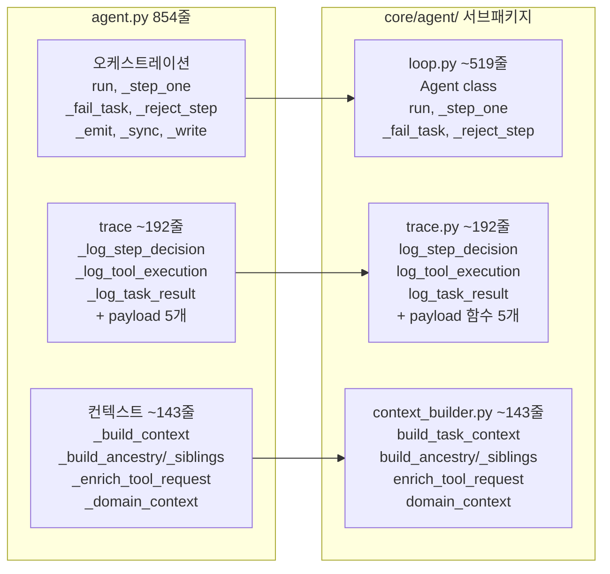
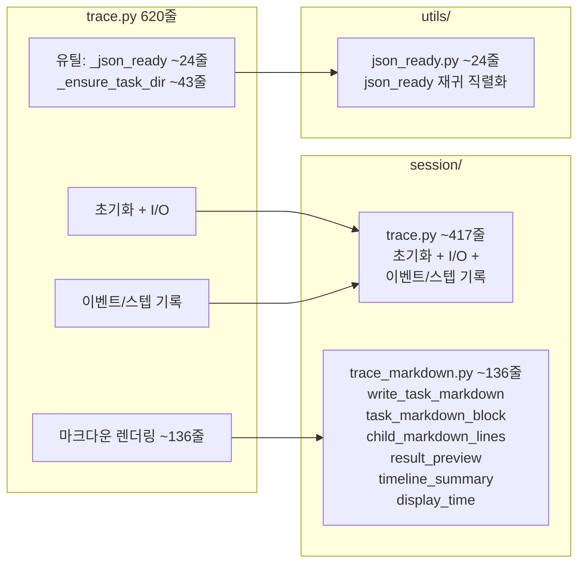
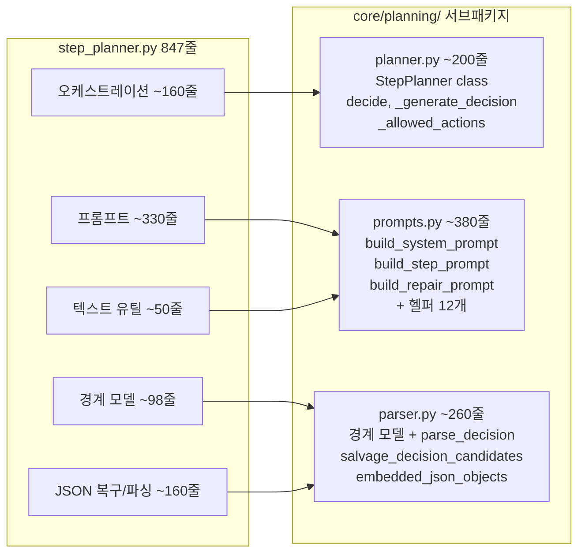
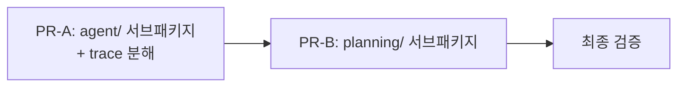

# Valuator 리팩토링 잔여 작업

2개 PR. PR-A는 core/agent/ 서브패키지화 + session/trace 분해. PR-B는 core/planning/ 서브패키지화.

## 전체 변경 조감도

### Before (현재)

```
valuator/
├── core/
│   ├── agent.py              854줄 ◀ trace+context+오케스트레이션 혼재
│   ├── step_planner.py       847줄 ◀ 프롬프트+파싱+오케스트레이션 혼재
│   ├── scheduler.py           515줄
│   ├── task.py                121줄
│   ├── types.py                80줄
│   ├── context.py              36줄
│   ├── shared_state.py        108줄
│   └── decomposition/
│       ├── types.py, gate.py, critic.py, controller.py
├── session/
│   ├── store.py               718줄
│   ├── trace.py               620줄 ◀ 마크다운+유틸+I/O 혼재
│   └── browse_tree.py         227줄
├── tools/ ...
├── models/ ...
└── utils/ ...
```

### After (2 PR 완료 후)

```
valuator/
├── core/
│   ├── agent/                 ★ NEW 서브패키지 (agent.py 854줄을 분해)
│   │   ├── __init__.py        re-export Agent
│   │   ├── loop.py     ~519줄 run, _step_one, 에러 처리, 이벤트 발행
│   │   ├── trace.py    ~192줄 이벤트 기록 + payload 직렬화
│   │   └── context_builder.py ~143줄 TaskContext 조립 + 도구 인자 보강
│   ├── planning/              ★ NEW 서브패키지 (step_planner.py 847줄을 분해)
│   │   ├── __init__.py        re-export StepPlanner
│   │   ├── planner.py  ~200줄 오케스트레이션
│   │   ├── prompts.py  ~380줄 프롬프트 조립
│   │   └── parser.py   ~260줄 JSON 복구 + 파싱
│   ├── decomposition/         기존 서브패키지
│   │   ├── types.py, gate.py, critic.py, controller.py
│   ├── scheduler.py           515줄
│   ├── task.py                121줄
│   ├── types.py                80줄
│   ├── context.py              36줄
│   └── shared_state.py        108줄
├── session/
│   ├── store.py               718줄
│   ├── trace.py              ~417줄 (마크다운+유틸+task_dir_init 제거)
│   ├── trace_markdown.py     ~136줄  ★ NEW
│   └── browse_tree.py         227줄
├── tools/ ...
├── models/ ...
└── utils/
    ├── ...기존 파일들
    └── json_ready.py          ~24줄  ★ NEW (재귀 직렬화 유틸, trace에서 이동)
```

**core/ 최상위: 5파일 + 3서브패키지.** 서브패키지 기준: 3+ 파일, 한 관심사, 퍼블릭 인터페이스 하나.

- `agent/` -- 에이전트 실행 루프. 외부는 `Agent`만 import.
- `planning/` -- LLM 결정 경계. 외부는 `StepPlanner`만 import.
- `decomposition/` -- 분해 게이팅 (기존). 외부는 `GateController`, `GateConfig` 등 import.

---

## PR-A: agent/ 서브패키지 + session/trace 분해

### Part 1: agent.py 854줄 -> core/agent/ 서브패키지



**`core/agent/__init__.py`** -- `from .loop import Agent` (외부 import 경로 불변)

**`core/agent/trace.py` (8개 함수, ~192줄)** -- 이벤트 기록 + payload 직렬화. 상태 없는 모듈 함수.

- `log_step_decision` (59줄), `log_tool_execution` (29줄), `log_task_result` (32줄)
- `decision_input_payload` (23줄), `decision_payload` (5줄), `task_runtime_payload` (23줄), `task_summary_payload` (8줄), `planned_child_records` (13줄)

**`core/agent/context_builder.py` (7개 함수, ~143줄)** -- TaskContext 조립 + 도구 인자 보강. scheduler, analysis 등을 매개변수로 받는 모듈 함수.

- `build_task_context` (30줄), `build_ancestry` (21줄), `build_siblings` (20줄), `registered_tools` (6줄), `query_units_for_task` (12줄), `enrich_tool_request` (28줄), `domain_context` (31줄)

loop.py 호출 예시:

```python
from . import trace as agent_trace
from . import context_builder

ctx = context_builder.build_task_context(
    task=task, query=query, scheduler=self._scheduler,
    analysis=self._analysis, shared=self._shared, tools=self._tools)
agent_trace.log_step_decision(writer, task=task, task_seq=seq, ctx=ctx, ...)
```

### Part 2: session/trace.py 620줄 -> ~417줄



추출 대상:

- **trace_markdown.py (~136줄, NEW)**: 마크다운 렌더링 6개 메서드 -> 모듈 함수. `_write_task_markdown`, `_task_markdown_block`, `_child_markdown_lines`, `_result_preview`, `_timeline_summary`, `_display_time`
- **utils/json_ready.py (~24줄, NEW)**: `_json_ready` -> `json_ready`. Enum, Path, dataclass, Pydantic 모델을 JSON-safe dict로 변환하는 범용 재귀 직렬화. trace 외에서도 재사용 가능.
- **`_ensure_task_dir` (~43줄)**: self 의존 제거, trace.py 내 standalone 모듈 함수로 전환 (파일 이동 없음)

---

## PR-B: step_planner.py -> core/planning/ 서브패키지

### 이동 흐름



**`core/planning/__init__.py`** -- `from .planner import StepPlanner` (외부 import 경로 불변)

**`core/planning/planner.py` (~200줄)** -- thin orchestrator. StepPlanner class, decide, _generate_decision, _allowed_actions, _decision_schema. prompts와 parser를 import하여 위임.

**`core/planning/prompts.py` (~380줄)** -- 프롬프트 텍스트 조립. config 값은 함수 매개변수로 주입. 의존: `domain.query`, `core.context`, `core.task`, `core.types`, `tools.specs`.

**`core/planning/parser.py` (~260줄)** -- LLM 응답 -> TaskDecision 변환. Pydantic 경계 모델(`_ToolRequestPayload`, `_TaskSpecPayload`, `_TaskDecisionPayload`) + JSON 복구 파이프라인. 퍼블릭: `parse_decision(task, raw) -> TaskDecision`. structured output 전환 시 이 파일만 교체.

planner.py 호출 예시:

```python
from .prompts import build_step_prompt, build_system_prompt
from .parser import parse_decision

class StepPlanner:
    async def decide(self, task, ctx) -> TaskDecision:
        user_prompt = build_step_prompt(task, ctx, ...)
        system = build_system_prompt(task, ctx, ...)
        return await self._generate_decision(task, user_prompt, system, ...)

    async def _generate_decision(self, ...) -> TaskDecision:
        raw = await self._llm.generate_json(...)
        return parse_decision(task, raw)
```

---

## 실행 순서



PR-A와 PR-B는 접촉 파일이 겹치지 않아 순서 자유. 각 PR 후:

```bash
python -m pytest tests/
ruff check .
ruff format .
```

---

## 보류 유지 (이번 범위 밖)

**구조 변경 (파급 넓음, 선행 조건 있음)**

- **Task 가변성 축소** — 15+ mutable 속성을 TaskExecutionState로 분리. Scheduler/Agent 전면 변경 필요. PR-A 이후 agent/loop.py가 519줄로 줄어든 뒤 착수.
- **Config God Class (39필드)** — 중첩 frozen dataclass 분할 + DI 전환. 현재 실제 마찰 없음.

**모듈 분해 (독립 진행 가능, 우선순위 낮음)**

- **SessionTraceWriter 잔여** (~417줄, PR-A 후) — 마크다운+유틸 추출 후 남는 코드는 `_lock`, `_sync_session`, `_write_json`을 공유하는 I/O+이벤트 기록. 추출하면 5+ 콜백 주입 필요해 복잡도 증가. 현 수준이 적정.
- **LLMUsageWriter (151줄)** — PR6에서 재설계 완료. 실제 마찰 없음.
- **domain_tool.py 프롬프트 (12줄)** — 실익 대비 관리 가치 낮음.
