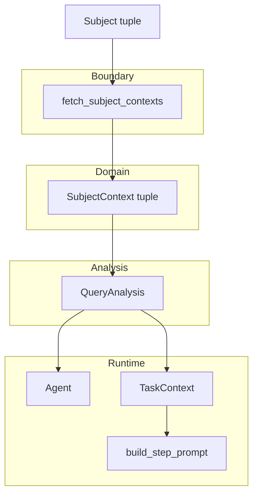

# Root planner: SubjectContext 아키텍처 (통합 정리)

이 문서는 [subject-context-plan.md](./subject-context-plan.md)의 구현 플랜과, **실행 단위 스코프·상태** 관점을 합쳐 **어떤 구조로 이루어지는지** 한곳에 정리한다. 시세 원천 확장은 [krx-kis-ontology-mapping.md](./krx-kis-ontology-mapping.md)를 본다.

---

## 1. 목표

- 매 step의 LLM 호출이 **동일한 전제**(회사 식별, 통화, 시장 스냅샷)를 공유한다.
- 그 전제는 **프롬프트 상단에 고정**되어 truncation으로 사라지지 않는다.
- **프로세스 전역 가변 싱글톤** 없이, **요청(파이프라인) 단위**로만 공유한다.

---

## 2. 레이어 구조

| 레이어 | 역할 | SubjectContext 관련 |
|--------|------|---------------------|
| **경계 (boundary)** | HTTP/OpenDart/yfinance·KIS 등에서 원시 데이터 수신 → 도메인 타입으로 변환 | `fetch_subject_contexts` — 실패 시 해당 subject만 생략 가능(플랜대로면 스킵 정책은 경계/상위에서 일관되게) |
| **도메인 (domain)** | `Subject`, `Listing`, `SubjectContext` 등 **불변** 값 객체 | `SecurityInfo`, `StockPrice`, `Indicator`, `SubjectContext` dataclass |
| **분석 컨텍스트** | 한 번의 질의에 대한 해석 결과 | `QueryAnalysis.subject_contexts` — 파이프라인 진입 시 1회 채움, 이후 **읽기 전용**으로 취급 |
| **실행 컨텍스트** | 에이전트·태스크가 실제로 참조하는 바인딩 | `TaskContext.subject_contexts` — `build_task_context()`에서 `QueryAnalysis`로부터 전달 |
| **프롬프트** | LLM 입력 조립 | `subject_context_text()` + `build_step_prompt()`에서 `sections` 최상단 삽입 |
| **도구 (tools)** | 기존 도구는 변경 없이 유지 가능; 스냅샷과 중복 fetch 완화 | 플랜: 도구 동작 변경 없음 |

원칙: **“전역 상태”라는 이름 대신, `QueryAnalysis` → `TaskContext`로 내려오는 불변 스냅샷**으로 모델링한다.

---

## 3. 데이터 흐름 (요청 1건 기준)

순서 요약:

1. `build_query_analysis()` → `subjects` 포함된 `QueryAnalysis` 초안
2. `fetch_subject_contexts(subjects, as_of_utc)` → `SubjectContext` 튜플
3. `analysis.subject_contexts = contexts` (또는 생성자/팩토리에서 한 번에 조립)
4. `Agent(query_analysis=analysis)`
5. `build_task_context()` → `ctx.subject_contexts = analysis.subject_contexts`
6. `build_step_prompt()` → `[SUBJECT_CONTEXT]`를 sections 첫 번째에 삽입

---

## 4. 상태 모델 (합쳐서 본 정의)

| 구분 | 설명 |
|------|------|
| **스코프** | 한 번의 `run_recursive_agent_query`(또는 동등한 엔트리) = 하나의 실행 단위. 동시에 여러 요청이 있어도 **인스턴스 필드로만** 붙고 서로 섞이지 않음. |
| **변경** | 스냅샷 생성 후 `SubjectContext` / `subject_contexts` 튜플은 **불변**으로 두는 것이 기본. task가 중간에 시세를 “갱신”하지 않음. |
| **시점** | `fetched_at`(및 `as_of_utc`)으로 **어느 시점의 전제인지** 재현 가능하게 둠. |
| **부분 실패** | 일부 subject만 fetch 실패 시 빈 슬롯·해당 subject 생략 등 **한 가지 규약**을 정하고, 그 결과를 프롬프트에 반영; 비즈니스 로직 전역에 방어 분기 난립을 피함. |
| **동시성** | 병렬 fetch는 경계에서 `gather` 등으로 처리; 외부 API 레이트는 **경계 또는 클라이언트**에서 제한하는 편이 안전. |
| **관측** | 세션 트레이스에 실제 주입된 `[SUBJECT_CONTEXT]` 문자열(또는 직렬화)을 남기면 근거 추적이 쉬움. |

---

## 5. 온톨로지·시세 원천과의 관계

- 도메인 타입은 stockelper-kg의 **Security / StockPrice / Indicator** 개념과 맞춘다 ([subject-context-plan](./subject-context-plan.md)).
- **구현 1차**는 플랜대로 `listing.yahoo_symbol` → yfinance 등으로 스냅샷을 채울 수 있다.
- **국내 정식 채널**로 확장할 때는 종목 메타는 OpenDart/`Listing`, 시세·지표는 KIS 등으로 바꾸되 **같은 `SubjectContext` 경계**에서 채우면 상위 레이어는 동일하다 ([krx-kis-ontology-mapping](./krx-kis-ontology-mapping.md)).

---

## 6. 의도적으로 두지 않는 것 (플랜과 동일)

- Subject/Company/Listing 타입의 불필요한 확장 없이 스냅샷만 추가
- 스냅샷용 별도 **프로세스 전역 캐시 레이어** 없음 (요청당 1회 fetch, 이후 immutable)
- **Registry / coordinator / manager**로 실행 흐름을 복잡하게 쪼개지 않음 — 데이터는 `QueryAnalysis` → `TaskContext` 직선 전달

---

## 7. 관련 문서

- [subject-context-plan.md](./subject-context-plan.md) — 타입, 파일별 변경, 토큰 예산, 검증
- [subject-context-refinement-plan.md](./subject-context-refinement-plan.md) — 파일 분리·식별자 매핑·프롬프트 정책 등 후속 정리
- [krx-kis-ontology-mapping.md](./krx-kis-ontology-mapping.md) — KRX·KIS·온톨로지 필드 매핑
