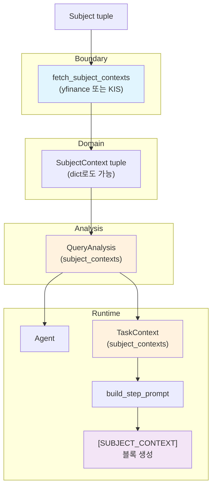

# Root Planner: SubjectContext 설계 문서

이 문서는 매 LLM 호출이 동일한 회사 정보와 시장 스냅샷을 공유하도록 하는 **SubjectContext** 기능의 전체 설계를 담는다.
파이프라인 시작 시 1회 fetch한 데이터를 모든 단계의 프롬프트 최상단에 고정 주입하여, 컨텍스트 길이 제약으로 인한 정보 손실을 방지한다.

---

## 1. 개요 (Overview)

### 해결하는 문제

1. **회사 정보 누락**: ticker, exchange, currency가 프롬프트에 없어 task가 잘못된 ticker/통화를 사용
2. **시장 데이터 소실**: 현재 주가, 시가총액, PER/PBR 같은 기본 전제가 task tree 깊어질수록 truncation으로 소실
3. **중복 fetch**: 모든 task가 독립적으로 동일한 기초 데이터를 tool로 재요청

### 핵심 해법

파이프라인 시작 시 외부 데이터 소스(yfinance 또는 KIS)로부터 시장 스냅샷을 1회 fetch하고,
이를 불변 데이터 구조(`SubjectContext`)로 변환하여 `QueryAnalysis` → `TaskContext`로 전달한다.
`build_step_prompt()`에서 `[SUBJECT_CONTEXT]` 블록으로 포맷하여 매 프롬프트 최상단에 삽입하므로,
budget reduction 재귀에 의해 절대 truncation되지 않는다.

---

## 2. 아키텍처 (Architecture)

### 2.1 레이어 구조

| 레이어 | 역할 | SubjectContext 관련 |
|--------|------|---------------------|
| **경계 (boundary)** | HTTP/OpenDart/yfinance·KIS 등에서 원시 데이터 수신 → 도메인 타입으로 변환 | `fetch_subject_contexts` — 실패 시 해당 subject만 생략 가능 |
| **도메인 (domain)** | `Subject`, `Listing`, `SubjectContext` 등 **불변** 값 객체 | `Security`, `StockPrice`, `Indicator`, `SubjectContext` dataclass |
| **분석 컨텍스트** | 한 번의 질의에 대한 해석 결과 | `QueryAnalysis.subject_contexts` — 파이프라인 진입 시 1회 채움, 이후 **읽기 전용** |
| **실행 컨텍스트** | 에이전트·태스크가 실제로 참조하는 바인딩 | `TaskContext.subject_contexts` — `build_task_context()`에서 `QueryAnalysis`로부터 전달 |
| **프롬프트** | LLM 입력 조립 | `subject_context_text()` + `build_step_prompt()`에서 `sections` 최상단 삽입 |
| **도구 (tools)** | 기존 도구는 변경 없이 유지 가능; 스냅샷과 중복 fetch 완화 | 플랜: 도구 동작 변경 없음 |

원칙: **"전역 상태"라는 이름 대신, `QueryAnalysis` → `TaskContext`로 내려오는 불변 스냅샷**으로 모델링한다.

### 2.2 데이터 흐름



**순서 요약:**

1. `build_query_analysis()` → `subjects` 포함된 `QueryAnalysis` 초안
2. `fetch_subject_contexts(subjects, as_of_utc)` → `SubjectContext` 튜플 또는 dict
3. `analysis.subject_contexts = contexts` (또는 생성자/팩토리에서 한 번에 조립)
4. `Agent(query_analysis=analysis)`
5. `build_task_context()` → `ctx.subject_contexts = analysis.subject_contexts`
6. `build_step_prompt()` → `[SUBJECT_CONTEXT]`를 sections 첫 번째에 삽입

### 2.3 상태 모델

| 구분 | 정의 |
|------|------|
| **스코프** | 한 번의 `run_recursive_agent_query`(또는 동등한 엔트리) = 하나의 실행 단위. 동시에 여러 요청이 있어도 **인스턴스 필드로만** 붙고 서로 섞이지 않음. |
| **변경성** | 스냅샷 생성 후 `SubjectContext` / `subject_contexts` 튜플은 **불변**으로 두는 것이 기본. task가 중간에 시세를 "갱신"하지 않음. |
| **시점 추적** | `fetched_at`(및 `as_of_utc`)으로 **어느 시점의 전제인지** 재현 가능하게 둠. |
| **부분 실패** | 일부 subject만 fetch 실패 시 식별자 기반 lookup으로 처리; 누락된 subject는 프롬프트에 "missing" 표시. 비즈니스 로직 전역에 방어 분기 난립을 피함. |
| **동시성** | 병렬 fetch는 경계에서 `asyncio.gather` 등으로 처리; 외부 API 레이트는 **경계 또는 클라이언트**에서 제한. |
| **관측성** | 세션 트레이스에 실제 주입된 `[SUBJECT_CONTEXT]` 문자열(또는 직렬화)을 남기면 근거 추적이 쉬움. |

---

## 3. 도메인 타입 (Domain Types)

### 3.1 모듈 구조

| 경로 | 역할 |
|------|------|
| `domain/subject_snapshot.py` (신규) | 불변 값 객체: `Security`, `StockPrice`, `Indicator`, `SubjectContext` |
| `domain/subject_context.py` (신규) | `fetch_subject_contexts` — 경계: 외부 API 호출 → 위 타입으로 변환 |
| `domain/company.py` | **변경 없음** — 기존 `Subject`, `Company`, `Listing` 유지 |

### 3.2 타입 정의

#### Security — 종목 고유 식별자

```python
@dataclass(frozen=True, slots=True)
class Security:
    """종목 메타정보"""
    ticker: str              # e.g., "005930.KS"
    exchange: str            # e.g., "KRX"
    currency: str            # e.g., "KRW"
```

#### StockPrice — 시세

```python
@dataclass(frozen=True, slots=True)
class StockPrice:
    """당일 시세"""
    current_price: float | None
    market_cap: float | None
```

#### Indicator — 지표

```python
@dataclass(frozen=True, slots=True)
class Indicator:
    """평가 지표"""
    trailing_pe: float | None      # 현재 PER
    forward_pe: float | None       # 예상 PER
    price_to_book: float | None    # PBR
    eps: float | None              # EPS
    bps: float | None              # BPS
```

#### SubjectContext — 통합 스냅샷

```python
@dataclass(frozen=True, slots=True)
class SubjectContext:
    """회사 컨텍스트 + 시장 스냅샷 (요청 시점 기준 불변)"""
    company_name: str                              # e.g., "삼성전자"
    company_id: str | None                         # 식별자 (dict 키용)
    security: Security
    stock_price: StockPrice | None                 # 없을 수 있음
    indicator: Indicator | None                    # 없을 수 있음
    enterprise_value: float | None
    fetched_at: str                                # ISO 8601 KST
```

### 3.3 식별자 기반 보관

**원칙**: `Subject` 튜플과 `SubjectContext` 튜플을 순서만으로 대응시키지 않는다.
일부 subject 스킵 시 인덱스 불일치로 잘못된 컨텍스트가 붙을 수 있기 때문이다.

**권장 구조**:
- `SubjectContext`에 **`company_id`** 또는 **`listing_id`** 필드를 필수로 두거나,
- 상위에서 **`dict[str, SubjectContext]`** 로 관리 (키: `company_id` 또는 `listing_id`)

프롬프트 생성 시:
```python
for subject in query_intent.subjects:
    ctx = subject_contexts_dict.get(subject.company_id)
    if ctx:
        # 렌더링
    else:
        # "누락" 표시
```

### 3.4 실패 및 누락 추적

`fetch_subject_contexts` 함수는 다음 규약을 따른다:

- **Listing 없는 Subject**: 건너뜀
- **fetch 실패한 Subject**: 해당 키에 엔트리 없음 또는 `SubjectContextFetchReport` 별도 기록
- **프롬프트 반영**: `[SUBJECT_CONTEXT]` 블록 상단 또는 하단에 상태 한 줄  
  예: `snapshot_status: ok | partial | unavailable`
  선택적 `missing: [회사명1, 회사명2]`

---

## 4. 구현 계획 (Implementation)

### 4.1 파일 변경 목록

| 순서 | 파일 | 변경 내용 | 라인 수 |
|------|------|-----------|--------|
| 1 | `domain/subject_snapshot.py` (신규) | `SecurityInfo`, `SubjectMarketSnapshot`, `SubjectValuationMetrics`, `SubjectContext` dataclass | ~40 |
| 2 | `domain/subject_context.py` (신규) | `fetch_subject_contexts` 함수 + 경계 로직 | ~35 |
| 3 | `domain/query.py` | `QueryAnalysis`에 `subject_contexts: dict[str, SubjectContext] = field(default_factory=dict)` 추가 + import | ~3 |
| 4 | `valuator/core/context.py` | `TaskContext`에 `subject_contexts: dict[str, SubjectContext] = field(default_factory=dict)` 추가 + import | ~3 |
| 5 | `valuator/core/agent/context_builder.py` | `build_task_context()`에서 `ctx.subject_contexts = analysis.subject_contexts` | ~1 |
| 6 | `valuator/core/planning/prompts.py` | `subject_context_text()` 함수 + `build_step_prompt()`에서 sections.insert(0, ...) + system prompt 설명 추가 | ~25 |
| 7 | `scripts/run_recursive_agent_query.py` | `fetch_subject_contexts` 호출 + assignment | ~5 |

**총 ~112줄. 신규 파일 2개. 기존 타입(`Subject`, `Company`, `Listing`) 변경 없음.**

### 4.2 fetch_subject_contexts 시그니처

```python
async def fetch_subject_contexts(
    subjects: tuple[Subject, ...],
    as_of_utc: str,
) -> dict[str, SubjectContext]:
    """
    각 Subject의 정보를 외부 데이터 소스로부터 fetch하여 SubjectContext로 변환.
    
    - subjects: 분석 대상 회사들
    - as_of_utc: ISO 8601 형식의 시점 (재현성)
    
    동작:
    - listing 없는 subject는 건너뜀
    - fetch 실패한 subject는 dict에서 제외
    - 병렬 처리: asyncio.gather + asyncio.to_thread
    
    반환:
    - dict[str, SubjectContext]: company_id를 키로, SubjectContext를 값으로
    """
```

### 4.3 진실 공급원 (QueryAnalysis vs TaskContext)

**선택: Option A** — `QueryAnalysis.subject_contexts`를 canonical로 삼는다.

- `fetch_subject_contexts()`의 결과를 `analysis.subject_contexts`에 저장
- `build_task_context()`에서 이를 복사: `ctx.subject_contexts = analysis.subject_contexts`

**이유**:
- 세션 트레이스에 `QueryAnalysis`가 남으므로, 재현과 디버깅이 용이
- `TaskContext`가 `query_analysis` 참조를 가지면 중복 제거 가능 (선택적 최적화)

### 4.4 데이터 흐름

```python
# scripts/run_recursive_agent_query.py
analysis = build_query_analysis(...)  # subjects 포함

# 스냅샷 fetch
subject_contexts = await fetch_subject_contexts(
    analysis.query_intent.subjects,
    as_of_utc=datetime.now(timezone.utc).isoformat()
)
analysis.subject_contexts = subject_contexts

# Agent 시작
agent = Agent(query_analysis=analysis)
...
```

---

## 5. 프롬프트 정책 (Prompt Policy)

### 5.1 [SUBJECT_CONTEXT] 블록 비절단 원칙

**규칙**: `[SUBJECT_CONTEXT]` 블록은 **절대 truncate되지 않는다.**

`build_step_prompt()`에서:
```python
# 무조건 첫 번째 섹션으로 삽입
sections.insert(0, subject_context_text(ctx))
```

`truncate_section_if_needed()` 등의 budget reduction 로직이 각 섹션을 줄일 때:
1. `[SUBJECT_CONTEXT]` 제외
2. `[CHILD_OUTPUTS]`, `[PREVIOUS_STEP]` 등 다른 블록부터 감축

코드에 명시적 주석:
```python
# POLICY: [SUBJECT_CONTEXT] is never truncated.
# Reduce other blocks ([CHILD_OUTPUTS], etc.) first.
```

### 5.2 토큰 예산 분석

| 대상 수 | 예상 크기 | 150K 대비 |
|---------|-----------|-----------|
| 1 subject | ~200 chars | 0.13% |
| 2 subjects | ~430 chars | 0.29% |
| 4 subjects | ~850 chars | 0.57% |

프롬프트 포맷 예시:
```
[SUBJECT_CONTEXT]
Status: ok
삼성전자 (005930.KS, KRX) | currency=KRW | price=67,400 | mkt_cap=402.6T | trailing_pe=12.45 | forward_pe=10.23 | pbr=1.32
SK하이닉스 (000660.KS, KRX) | currency=KRW | price=180,500 | mkt_cap=107.5T | trailing_pe=8.90 | forward_pe=7.80 | pbr=0.95
```

---

## 6. 데이터 소스 (Data Sources)

### 6.1 기본 구현: yfinance

1차 구현은 `Listing.yahoo_symbol` → `yf.Ticker(symbol).info` 호출로 스냅샷을 채운다.

### 6.2 KIS REST API 및 온톨로지 매핑

> **이전됨**: 온톨로지 노드별 매핑, KIS API 상세, ISIN, 구현 순서, 참고 링크는
> [opendart-financial-collector-plan.md](../open-dart-financial/opendart-financial-collector-plan.md)의 "외부 데이터 소스 매핑" 섹션으로 통합되었다.

---

## 7. 설계 제약 (Design Constraints)

**의도적으로 하지 않는 것:**

- **Subject/Company/Listing 타입 확장 없음**: 새 필드를 기존 타입에 추가하지 않는다. 스냅샷은 별도 dataclass만 추가.
- **프로세스 전역 캐시 없음**: 스냅샷은 파이프라인 시작 시 1회 fetch, 이후 불변. 요청 간 공유 상태 없음.
- **내부 validation 추가 없음**: 경계에서만 검증/정규화. 비즈니스 로직은 타입 존재 자체를 검증 증거로 신뢰.
- **Tool 동작 변경 없음**: 기존 `yfinance_balance_sheet` 등은 그대로 사용 가능. 스냅샷과 중복 호출 완화만 목표.
- **Registry/coordinator/manager 패턴 없음**: 복잡한 오케스트레이션 없이 `QueryAnalysis` → `TaskContext` 직선 전달.
- **단일 분기 추가 타입화**: "다양한 데이터 소스" 때문에 타입을 폭발시키지 않는다. 경계 구현만 바뀐다.

---

## 8. 검증 (Verification)

### 8.1 회귀 테스트

```bash
python -m pytest tests/
```

기존 테스트 전체 통과 확인. `SubjectContext` 관련 새 모듈도 단위 테스트 추가.

### 8.2 수동 검증

1. 실제 쿼리 실행 후 세션 trace 확인
2. 모든 step prompt 최상단에 `[SUBJECT_CONTEXT]` 블록 존재
3. 상태 표시 (ok/partial/unavailable) 정확성

### 8.3 graceful degradation

yfinance 또는 KIS 불가 환경:
- `subject_contexts = {}` (빈 dict)
- 프롬프트: `[SUBJECT_CONTEXT] Status: unavailable`
- 파이프라인 정상 동작 (LLM이 context 없이 답변)

---

## 9. 관련 문서

이 문서는 다음을 통합한다:

- **초기 기능 설계**: 문제 정의, dataclass 정의, 파일별 변경, 토큰 예산
- **구조 개선안**: 파일 분리, 식별자 안정성, 실패 가시성, 비절단 정책, 진실 공급원 결정
- **아키텍처 통합**: 6-layer 모델, 데이터 흐름, 상태 모델
- **외부 데이터 소스**: KIS/KRX API 매핑, 온톨로지 정합 (`Security`, `StockPrice`, `Indicator`), 구현 순서
