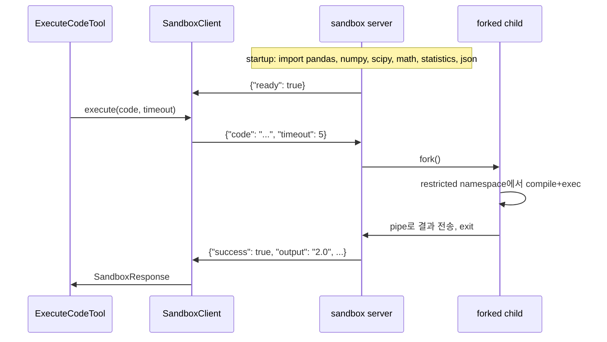

# Sandbox Server Code Execution

## 동기

현재 `code_execute_tool`은 매 호출마다 `subprocess.run()`으로 새 프로세스를 spawn한다. pandas/numpy를 허용하면 import에 ~500ms가 소요되어 3초 timeout의 대부분을 잡아먹는다. persistent server process가 모듈을 미리 로드하고, 요청마다 `fork()`하면 COW로 import 비용 0, 자식 종료로 메모리 누수 0.

## 아키텍처



## 파일 변경 계획

### 1. NEW: `valuator/tools/sandbox/protocol.py`

request/response를 dataclass로 정의. 서버와 클라이언트 양쪽에서 import.

```python
@dataclass(frozen=True)
class SandboxRequest:
    code: str
    timeout: int

@dataclass(frozen=True)
class SandboxResponse:
    success: bool
    output: str
    execution_type: str  # "eval" | "exec" | "failed"
    error: str
```

JSON 직렬화는 `dataclasses.asdict` + `json.dumps/loads`. 별도 라이브러리 불필요.

### 2. NEW: `valuator/tools/sandbox/executor.py`

fork 기반 격리 실행 함수 하나.

- `fork_and_execute(request: SandboxRequest, preloaded: dict) -> SandboxResponse`
- 부모: `os.pipe()` 생성 → `os.fork()` → `os.waitpid()` with timeout → timeout 초과 시 `SIGKILL`
- 자식: `signal.alarm(timeout)` → restricted namespace에서 compile/exec → pipe로 결과 write → `os._exit(0)`
- namespace 구성: `SAFE_BUILTINS`에 `__import__` 미포함 + pre-loaded 모듈을 namespace에 직접 주입 (`np`, `pd`, `scipy`, `math`, `statistics`, `json`). import 문 자체가 동작하지 않으므로 import guard 불필요

현재 [code_execute_tool.py](../valuator/tools/code_execute_tool.py) 14-95행의 `_HARNESS` 문자열 로직을 Python 함수로 변환. 문자열 코드 → 실제 함수로 바뀌므로 디버깅도 쉬워짐.

### 3. NEW: `valuator/tools/sandbox/server.py`

standalone 실행 가능한 스크립트 (`python -m valuator.tools.sandbox.server`).

```python
PRELOADED = {"np": numpy, "pd": pandas, "scipy": scipy, "math": math, "statistics": statistics, "json": json}

# startup
import pandas, numpy, scipy, math, statistics, json
write_response(ReadySignal(preloaded=list(PRELOADED.keys())))

# main loop
for line in sys.stdin:
    request = parse_request(line)
    response = fork_and_execute(request)
    write_response(response)
```

stdin EOF → 정상 종료. 부모(valuator) 프로세스가 죽으면 stdin이 닫히므로 자동 정리.

### 4. MODIFY: `valuator/tools/code_execute_tool.py`

`ExecuteCodeTool`을 sandbox server의 client로 전환.

**제거:**

- `_HARNESS` 문자열 (14-95행)
- `_build_command`, `_run_subprocess` 메서드
- `_SubprocessOutput` dataclass

**추가:**

- `SandboxClient` 내부 클래스 또는 별도 import
  - `Popen`으로 server process 보유 (stdin/stdout pipe)
  - `spawn()`: server 시작 + ready 신호 대기
  - `execute(request) -> SandboxResponse`: JSON line write → read
  - `alive` property: process poll
- `_ensure_server()`: lazy init + crash 시 재시작

**유지 (변경 없음):**

- `_normalize_code`, `_resolve_timeout` — 입력 정규화 로직. `_allowed_imports` 제거
- `_execute_impl`의 ToolResult 변환 로직 — response를 ToolResult로 매핑하는 부분
- `_base_metadata` — metadata에 `"isolation": "fork_server"` 로 변경

핵심 변경:

```python
class ExecuteCodeTool(ReActBaseTool):
    _client: _SandboxClient | None = None

    async def _execute_impl(self, code, timeout, language):
        # ... normalize, validate (현재와 동일) ...
        client = self._ensure_client()
        request = SandboxRequest(code=normalized_code, timeout=timeout_value)
        response = await asyncio.to_thread(client.execute, request)
        return self._response_to_tool_result(response, normalized_code, metadata)
```

### 5. MODIFY: `valuator/utils/config.py`

**제거:**

- `DEFAULT_CODE_EXECUTION_ALLOWED_IMPORTS` 상수
- `Config.code_execution_allowed_imports` 필드
- `load_config()`에서 `CODE_EXECUTION_ALLOWED_IMPORTS` env var 읽기

가용 모듈은 server.py의 `PRELOADED` 상수가 단일 진실 원천(single source of truth). config로 런타임에 바꿀 이유가 없음 — 모듈 추가/제거는 서버 코드 변경이므로 배포 단위.

`CODE_EXECUTION_TIMEOUT` 기본값 3초 유지 (import 비용이 사라졌으므로 충분).

### 6. NEW: `valuator/tools/sandbox/__init__.py`

빈 파일 또는 public export 최소화.

### 7. MODIFY: `tests/test_code_execute_tool.py`

기존 테스트 그대로 통과해야 함 (인터페이스 불변). 추가 테스트:

- numpy import + 계산 (`np.mean`, `np.std`)
- pandas import + 계산 (`pd.DataFrame`, `df.describe()`)
- timeout 동작 (infinite loop → timeout error)
- 차단된 import (`import os` → `__import__` 없음 에러)
- server crash 후 재시작 → 다음 호출 성공

## 에러 처리

- server process crash → `_ensure_client()`에서 `alive` 체크, 재시작
- fork child timeout → parent `waitpid` + `SIGKILL`, timeout error 반환
- fork child segfault → `waitpid` 비정상 종료 감지, error 반환
- stdin pipe broken → server process 재시작

## 설계 결정

- **MCP 프로토콜 미사용**: 소비자 1개, tool 1개. JSON lines over stdio가 최소 복잡도.
- **subprocess 폴백 미유지**: 두 경로 테스트 비용 > 폴백 이득. fork 방식이 상위 호환.
- **서버 수명: 영구**: fork 방식은 자식이 매번 종료되므로 메모리 누수 구조적 불가.
- **pre-load 범위**: `json`, `math`, `statistics`, `numpy`, `pandas`, `scipy`. namespace alias: `np`, `pd`, `scipy`, `math`, `statistics`, `json`.
- **`__import__` 미제공**: SAFE_BUILTINS에 `__import__`를 넣지 않음. import 문 자체가 동작 불가 → import guard 함수/config 불필요. allowed_imports config 제거.
- **`-I -S` 플래그 제거**: 더 이상 매번 python을 spawn하지 않으므로 불필요.
- **pandas I/O 경로**: 차단하지 않음. forked child는 즉시 종료되고, 네트워크 모듈 import 불가하므로 데이터 유출 수단 없음. 실질 위험 낮음.
