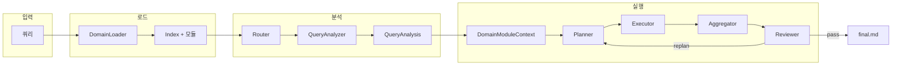
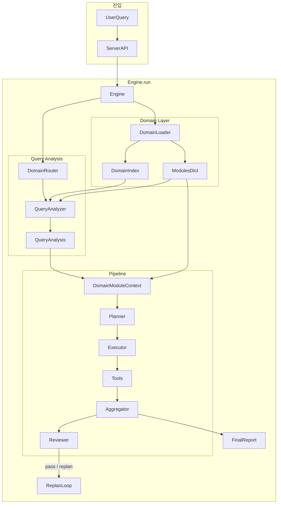

# Domain/Query 아키텍처 (기술 명세)

본 문서는 `valuator/domain/`, `valuator/core/orchestrator/`, `valuator/core/planner/` 등 실제 코드를 반영한 **최종 기술 명세**이다.

---

## 1. 한 번에 보는 흐름

아래 다이어그램과 단계만 보면 전체가 이어집니다.

**한 줄 요약**: 쿼리 → 도메인 YAML 로드 → **Query Analyzer(LLM 1회)** 로 사용할 도메인·요구사항·허용 도구 결정 → **DomainModuleContext**로 Planner/Executor/Aggregator/Reviewer에 바인딩 → Plan → 실행 → 합성 → 검수 → `final.md`.

| 단계 | 하는 일 |
|------|--------|
| 1 로드 | `DomainLoader`가 `index.yaml` + `ceo.yaml` 등 읽고 검증. |
| 2 분석 | Engine이 `QueryIntent(query=query)` 생성 후 **`DomainRouter.analyze(intent, index, modules)`** 호출. Router 내부에서 **QueryAnalyzer.analyze** → **QueryAnalysis**(domain_ids, entities, units, requirements, allowed_tools) 반환 후 `fill_routing_defaults`로 allowed_tools 채움. 여기서 `unit = step`, `entities = entity`, `relation = step -> entity_ids`로 해석되는 query breakdown이 결정된다. |
| 3 컨텍스트 | Engine이 **DomainModuleContext**(module_ids, modules=선택된 모듈 dict, query_intent, query_analysis) 생성 후 Planner/Executor/Aggregator/Reviewer에 `bind_domain_context`. |
| 4 계획·실행 | Planner는 허용 도구만 써서 Plan·PlanContract 작성. Executor는 그 도구만 실행(미허용 시 fail-fast). |
| 5 합성·검수 | Aggregator가 `[CONTRACT]` + `[DOMAIN_REPORT_CONTRACT]`로 리포트 합성. Reviewer가 계약/도메인 커버리지와 query breakdown(step/entity/relation) 전파 여부를 보고 pass/replan. |

---

## 2. 문제 정의

- **왜 나왔나**: 쿼리와 도메인(무슨 분석을 할지, 어떤 도구·리포트 기준)이 코드/프롬프트에 섞여 있어 확장·검증이 어려웠음.
- **해결**: 쿼리와 도메인을 분리하고, 도메인은 YAML 모듈로 두고, **Query Analysis(LLM 1회)** 로 “이번 쿼리에 쓸 도메인·요구사항·허용 도구”만 정한 뒤, 그 결과(**DomainModuleContext**)만 파이프라인에 넘김.

---

## 3. 설계 목표

- 쿼리/도메인 분리 · 데이터/계약 기반 · 도메인 제약 하 도구 선택 · 커버리지 가시성(Reviewer pass/replan) · 확장 용이(YAML/도구만 추가) · `VALUATOR_DOMAIN_ARCH_ENABLED`로 점진 롤아웃.

---

## 4. 핵심 개념 (최소만)

| 개념 | 의미 |
|------|------|
| **DomainIndex** | `domain/index.yaml`. 모듈 ID 목록 + Query Analysis용 메타(valuation_scope, exclusion_signals, selective_signals, module_summaries). |
| **DomainModule** | `domain/<id>.yaml` 한 파일. id, name, description, **tools**, prompt_fragment, **report_contract**, depends_on 등. |
| **DomainModuleContext** | 이번 세션의 활성 모듈 + query_intent + query_analysis. Engine이 Planner/Executor/Aggregator/Reviewer에 바인딩. |
| **QueryAnalysis** | Query Analyzer가 만드는 표준 사양. domain_ids, entities, units, requirements, allowed_tools, rationale. `units`는 step, `entities`는 entity, relation은 각 `unit.entity_ids`로부터 결정된다. |
| **DomainLoader** | `valuator/domain/` YAML 한 번 로드·검증. `load() -> (DomainIndex, dict[str, DomainModule])`. |

**파일 위치**: 도메인 정의는 `valuator/domain/` 아래 `index.yaml`(모듈 목록·Query Analysis 메타)과 `ceo.yaml`, `dcf.yaml`, `balance_sheet.yaml`, `risk_transmission.yaml`(모듈당 한 파일). 로더는 이 경로만 읽는다.

도메인 IR(DomainModuleOutput, DcfSummary 등)은 도구 실행 결과를 Aggregator/Reviewer가 쓰는 중간 형식이며, 타입은 `valuator/domain/types.py` 참고.

---

## 5. 시스템 아키텍처 (상세)

### 5.1 도메인 계층

- **DomainLoader**: `domain/index.yaml`과 index에 나열된 `<id>.yaml` 로드. `prompt_file` 있으면 해당 파일 내용을 `prompt_fragment`에 채움. `depends_on` 사이클·존재 검사. 통과한 데이터만 Router/Planner가 사용.
- **DomainModule** 필드 요약: `id`, `name`, `description`, `tools`(허용 도구 이름 목록), `domain_tools`, `prompt_fragment`/`prompt_file`, `report_contract`, `depends_on`, `tasks`(선택).

### 5.2 Query Analysis와 Router

- **QueryAnalyzer** (`query_analysis.py`): `analyze(query, index, modules)` → **QueryAnalysis**. index 메타를 프롬프트에 넣고 LLM으로 domain_ids, entities, units, requirements, allowed_tools, rationale 생성. 기본 가정: 밸류에이션 관련이면 전체 도메인, 예외/일부만 요청 시 선택적.
- **DomainRouter**: Engine은 **`analyze(intent, index, modules)`** 를 호출해 `(QueryIntent, QueryAnalysis)`를 받고, `fill_routing_defaults`로 선택 도메인 `tools` 합집합을 `allowed_tools`에 채움. Router는 Query Analysis 결과를 그대로 세션용으로 전달하는 역할.

### 5.3 Planner / Executor / Aggregator / Reviewer

- **Planner**: 바인딩된 도메인 컨텍스트 + analysis.allowed_tools로 허용 도구 집합 계산. 그 안에서만 단위별 도구 선택. QueryAnalysis의 requirements → PlanContract.
- **Executor**: 도메인 컨텍스트가 있으면 활성 모듈 `tools` 합집합에 없는 도구 호출 시 ValueError로 fail-fast.
- **Aggregator**: `[CONTRACT]`에 Plan 요구사항 + `[DOMAIN_REPORT_CONTRACT]` 포함. 도메인 상세는 `### [DOMAIN:<module_id>]`(활성 모듈 id만), 비도메인 섹션은 `### [SECTION:제목]`.
- **Reviewer**: `[DOMAIN_CONTEXT]`로 계약·도메인 커버리지 평가 후 pass/replan, coverage_feedback 반환.

**final.md 규칙**: `final.md`에는 query breakdown 전용 섹션을 강제로 추가하지 않는다. step/entity/relation은 reviewer가 `QUERY_SPEC.query_breakdown`을 기준으로 본문 전파 여부를 판정한다. 이후 도메인 상세는 `### [DOMAIN:<module_id>] <module_name>`(활성 모듈 id만), 비도메인 섹션은 `### [SECTION:제목]`으로 작성한다. 문서 끝에 `[CONTRACT_COVERAGE] R-001, R-002, ...`로 충족된 요구사항 ID 나열.

### 5.4 전체 데이터 흐름 (상세)

---

## 6. 확장·호환·리스크 (요약)

- **새 도메인**: `domain/<new_id>.yaml` 추가 후 `index.yaml`의 `modules`·`module_summaries`에 등록.
- **새 도구**: `planner`의 `_TOOL_ARGS`/`_TOOL_CAPABILITY`, `executor`의 `_TOOL_CLASSES` 등록 후 해당 도메인 YAML의 `tools`에 추가.
- **호환**: `VALUATOR_DOMAIN_ARCH_ENABLED`(env) → `config.domain_arch_enabled`. `false`면 도메인 로드/라우팅/컨텍스트 비활성, 기존 파이프라인만 사용.
- **리스크**: LLM 도메인 선택 오류(→ index 메타·Reviewer 보완), YAML·도구 불일치(→ 로더 검증·테스트), 커버리지 파서 오류(→ coverage_feedback 로그).
- **검증**: 도메인 아키텍처는 `VALUATOR_DOMAIN_ARCH_ENABLED=true`로 켠 뒤 `tests/test_query_pipeline.py`, `tests/test_semantic_requirements.py` 등으로 검증.
