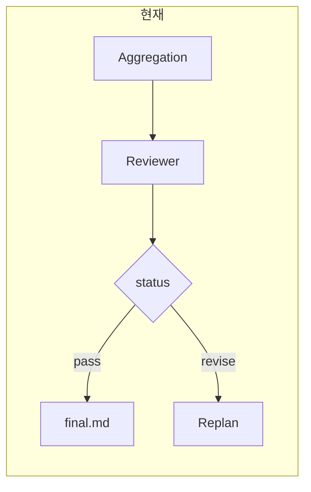
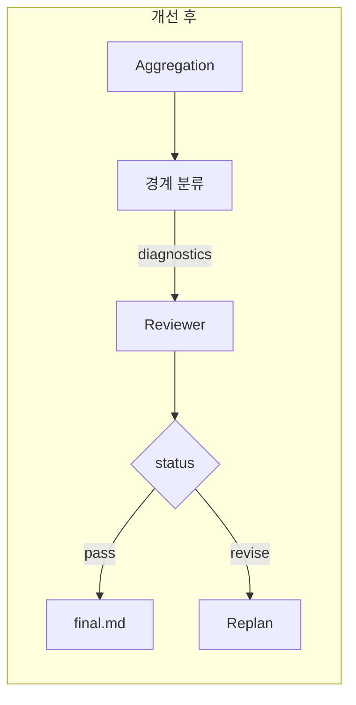

# Query Coverage 및 Review 개선 (기술 명세)

본 문서는 `valuator/core/reviewer/`, `valuator/core/orchestrator/`를 반영한 **구조적 커버리지 vs 내용 품질·충분성** 개선 기술 명세이다.  
원칙: 경계에서만 검증/분류, 비즈니스 로직 내 ensure/validate/규칙 분기 금지.

---

## 1. 한 번에 보는 흐름

**문제**: 구조적 coverage(requirement·domain·unit)는 채워졌는데 **내용 품질·충분성**이 부족해도 Reviewer가 pass로 끝남.

**패턴**: (1) 정책은 프롬프트로, (2) 수정 유발 신호는 **Reviewer 호출 직전 단일 경계**에서만 분류 → diagnostics 전달, (3) Fallback은 **이미 채워진 diagnostics 필드**만 참조.

---

## 2. 문제 정의

| 항목 | 내용 |
|------|------|
| **현상** | 구조적으로는 “다 채워진 것처럼” 보이지만, 실제 산출물에는 **내용 충분성·품질** 갭(데이터 한계, N/A 과다, 추가 소스 권유 등)이 있음. 그런데도 Reviewer는 `actions=[]`, `status=pass`로 종료함. |
| **목표** | “내용이 부족하면 보강(정보 수집·재실행 등)을 고려해 revise로 이어지게 한다”는 **정책**을, **경계를 명확히 한 채** 반영. |
| **확장** | 본 패턴은 “데이터 갭”에 한정되지 않음. **구조 외의 수정 유발 신호**(content sufficiency, semantic axis, source diversity 등)를 경계에서 한 번 분류해 Reviewer/fallback에 넘기는 **공통 패턴**으로 확장 가능. |

---

## 3. 가정·제약·경계

| 구분 | 내용 |
|------|------|
| **가정** | 내용 충분성/품질은 leaf artifact·final markdown의 텍스트 패턴 또는 구조화된 신호로 추정 가능. Reviewer LLM은 정책을 프롬프트로 주면 반영 가능. Replan은 “어떤 unit을 다시 돌릴지”만 받음. |
| **제약** | 경계 밖에서는 ensure/validate/normalize/규칙 분기 금지. 내용 충분성·품질 판단을 비즈니스 로직 안에 넣으면 금지. |
| **시스템 경계** | **입력**: query, domain router 분석, execution artifacts, aggregation final_markdown. **출력**: ReviewResult, replan 후 Plan. **검증/분류**: 경계에서 한 번만. |

---

## 4. 접근 방식 및 선택

| 접근 | 설명 | 장점 | 단점 |
|------|------|------|------|
| **A. 프롬프트만** | “내용 부족 시 보강·정보 수집 고려” 정책 문장만 추가 | 변경 최소, 경계 분리 유지 | LLM 일관성 불확실, fallback 연동 불가 |
| **B. 경계 분류** | Reviewer 호출 직전, 수정 유발 신호를 한 곳에서만 분류해 diagnostics로 전달 | 판단 한 곳 집중, 확장 용이 | 경계 모듈 설계 필요 |
| **C. Fallback 확장** | diagnostics에 경계 힌트가 있으면 LLM이 actions 비웠어도 fallback에서 revise | 구조 외 갭에도 revise | B와 결합 시 fallback은 채워진 필드만 참조해야 함 |

**선택**: 1순위 A → 2순위 B → 3순위 C. B·C는 A만으로 부족할 때 도입.

---

## 5. 구현 범위

### 5.1 Phase 1 (즉시)

| 항목 | 내용 |
|------|------|
| **파일** | `valuator/core/reviewer/prompts.py` |
| **위치** | `REVIEWER_SYSTEM` 내 "판정 규칙" 블록 마지막 다음 |
| **추가 문장** | `8) FINAL_MARKDOWN 또는 [EXECUTION_LAYER]에 대응하는 leaf 결과에 내용 부족·한계(Limitations, data gap, N/A 과다, 공식 제출자료·10-K 권유 등)가 명시된 경우, 해당 requirement/unit을 보강 대상으로 보고 actions에 "추가 정보 수집 필요"를 reason으로 포함하라.` |
| **터치** | `REVIEWER_SYSTEM` 한 곳만. 코드 분기/검증 추가 없음. |

### 5.2 Phase 2 (필요 시) — 경계 분류 패턴

| 항목 | 내용 |
|------|------|
| **모듈** | `valuator/core/reviewer/data_sufficiency.py` (신규) |
| **역할** | Reviewer 호출 직전, 수정 유발 신호 중 “내용 충분성” 한 종류 분류. 키워드/패턴은 이 모듈 안에만. 추후 동일 패턴으로 다른 신호 유형 확장 가능. |
| **입력** | `final_markdown: str`, `artifacts: list[ExecutionArtifact]`, `plan: Plan` |
| **출력** | `DataSufficiencyClassification(status: Literal["ok","gap_detected"], unit_ids_with_gap: list[int])` |
| **호출** | `engine._run_round` 내 aggregation·execution 확보 직후. `review(..., data_sufficiency=...)` 전달. |
| **Reviewer** | `review(..., data_sufficiency: DataSufficiencyClassification | None = None)`. `diagnostics`에 `data_sufficiency_status`, `unit_ids_with_gap` 반영. |

**경계 모듈 내부 (내용 충분성 인스턴스)**:
- 검사 대상: `final_markdown`, `ExecutionArtifact.content` (또는 `raw_result` 내 텍스트)
- task_id → unit_id: `plan.tasks`에서 `task_type=="leaf"`인 task의 `query_unit_ids[0]`
- 패턴 발견 시 `status="gap_detected"`, 해당 unit_id를 `unit_ids_with_gap`에 추가. 미발견 시 `status="ok"`, `unit_ids_with_gap=[]`
- 패턴/키워드: `data_sufficiency.py` 내부에만 정의 (경계이므로 허용)

### 5.3 Phase 3 (Phase 2 이후) — Fallback이 경계 힌트만 소비

| 항목 | 내용 |
|------|------|
| **파일** | `valuator/core/reviewer/service.py` |
| **조건** | LLM이 `actions` 비웠을 때 (`if not actions:` 블록) |
| **로직** | `_fallback_action_nodes(..., unit_ids_with_gap: list[int] | None = None)` 인자 추가. 내부 `nodes.update(unit_ids_with_gap or [])`. 호출부 `unit_ids_with_gap=diagnostics.get("unit_ids_with_gap") or []` |
| **reason 예** | `"content sufficiency gap for units; consider additional information gathering."` |
| **금지** | Fallback 내부에서 `final_markdown`·`artifacts` 직접 읽거나 키워드/정규식으로 새로 분류하지 않음. `diagnostics` 채워진 필드만 참조. |

### 5.4 Replan/도구 선택 (별도 설계)

- **입력**: `ReviewResult.actions[].reason`에 “추가 정보 수집”, “10-K”, “SEC” 등 포함 시
- **책임**: replan은 “어떤 unit을 다시 실행할지”만 결정. 도구/소스 전환은 별도 설계 후 구현.

---

## 6. 구현 터치포인트

| Phase | 파일 | 함수/상수 | 변경 |
|-------|------|-----------|------|
| 1 | `valuator/core/reviewer/prompts.py` | `REVIEWER_SYSTEM` | 규칙 8) 한 문장 추가 |
| 2 | `valuator/core/reviewer/data_sufficiency.py` | (신규) `DataSufficiencyClassification`, `classify_data_sufficiency` | 경계 분류 — 내용 충분성 첫 인스턴스 |
| 2 | `valuator/core/orchestrator/engine.py` | `_run_round` | 경계 호출, `review(..., data_sufficiency=...)` 전달 |
| 2 | `valuator/core/reviewer/service.py` | `review` | 인자 `data_sufficiency` 추가, `diagnostics`에 경계 결과 반영 |
| 3 | `valuator/core/reviewer/service.py` | `_fallback_action_nodes` | 인자 `unit_ids_with_gap` 추가, `nodes.update(...)` |
| 3 | `valuator/core/reviewer/service.py` | `review` 내 `if not actions:` | `_fallback_action_nodes` 호출 시 `unit_ids_with_gap` 전달 |

---

## 7. Proposals (구현 전 승인)

1. **즉시 적용**: Phase 1 — Reviewer 프롬프트에 내용 충분성 정책 문구 추가.
2. **경계 명시**: 수정 유발 신호를 코드로 판단할 경우, Reviewer 호출 직전 단일 경계 모듈에서만 수행. 출력 타입 최소 정의 후 Reviewer/fallback에 전달.
3. **금지 유지**: 비즈니스 로직에 키워드/정규식/규칙 분기 추가 금지. 분류는 경계 모듈로만.
4. **확장 시**: 새 힌트 유형 추가 시 동일 패턴 — 경계 분류 → diagnostics 전달 → Fallback은 채워진 필드만 참조.
