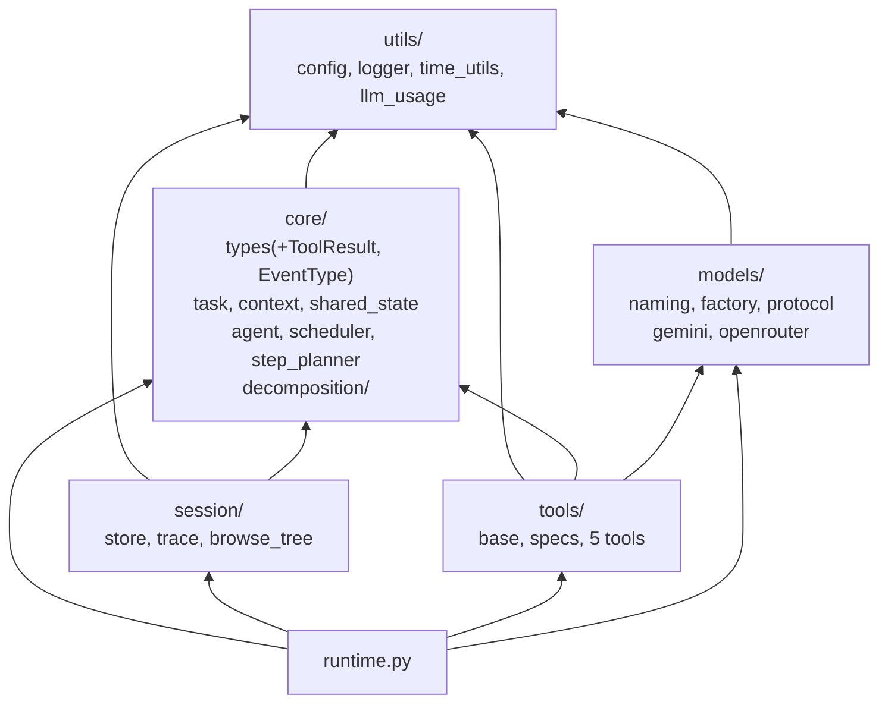

# Valuator 구조 + 의미 리팩토링

## CLAUDE.md 지침 공백 (6개)

1. **God Class 허용 기준 부재** — 클래스 수준 단일 책임 기준 없음.
2. **경계 위치 결정 미완결** — TokenUsage.from_raw, config 내 모델 해소 등 경계 코드가 내부에 침투.
3. **죽은 코드 정리 기준 부재** — validate_parameters, ContextTool 등 사용되지 않는 코드 잔존.
4. **모듈 그룹핑 기준 부재** — 응집도 기반 서브패키지 기준 없음.
5. **메서드 내 중복 제거 기준 부재** — agent._step_one, 모델 클라이언트의 반복 패턴.
6. **레이어 위반 감지 규칙 부재** — utils -> core 역방향 의존.

---

## 목표 구조

```
valuator/
│
├── __init__.py
├── runtime.py                           ← agent_runtime.py (62줄)
│
├── core/
│   ├── __init__.py                      re-export 업데이트
│   ├── agent.py                         1028줄 → ~650줄
│   ├── scheduler.py                     515줄
│   ├── step_planner.py                  866줄 (후속 대상)
│   ├── task.py                          121줄
│   ├── types.py                         57줄 → ~80줄 (+ToolResult, EventType)
│   ├── context.py                       36줄
│   ├── shared_state.py                  108줄
│   └── decomposition/
│       ├── __init__.py
│       ├── types.py                     79줄 (+validate_gate_config)
│       ├── gate.py                      177줄
│       ├── critic.py                    142줄
│       └── controller.py              NEW ~140줄
│
├── session/
│   ├── __init__.py
│   ├── store.py                         906줄 → ~700줄
│   ├── trace.py                         643줄 → ~620줄 (utc_isoformat/compact 제거)
│   └── browse_tree.py                  NEW ~210줄
│
├── tools/
│   ├── __init__.py
│   ├── base.py                          192줄 → ~90줄 (get_schema abstract 제거)
│   ├── specs.py                         293줄 → ~320줄 (+to_llm_schema)
│   ├── domain_tool.py                   154줄 → ~85줄 (get_schema 삭제)
│   ├── sec_tool.py                      317줄 → ~280줄
│   ├── web_search_tool.py               374줄 → ~340줄
│   ├── code_execute_tool.py             301줄 → ~275줄
│   └── yfinance_tool.py                409줄 → ~375줄
│
├── models/
│   ├── __init__.py
│   ├── naming.py                       NEW ~25줄 (MODEL_ALIASES, canonical_model_name, is_openrouter_model_name)
│   ├── factory.py                       33줄
│   ├── protocol.py                      34줄 → ~65줄 (+UsageWriter Protocol)
│   ├── gemini_direct.py                 375줄 → ~300줄
│   └── openrouter.py                    217줄 → ~170줄
│
└── utils/
    ├── __init__.py
    ├── config.py                        314줄 → ~280줄 (모델 로직 분리)
    ├── logger.py                        89줄
    ├── time_utils.py                   NEW ~45줄 (utc_isoformat, compact_utc_timestamp, Measurement)
    └── llm_usage.py                     ← core/llm_usage.py 이동 + ModelPrice + 재설계 (~120줄)
```

---

## 의존성 레이어




**해소되는 위반:**

- `utils/session_trace` -> `core/llm_usage`: session/trace -> utils/llm_usage (동일 계층 간 의존 제거)
- `core/task` -> `tools/base.ToolResult`: core/task -> core/types.ToolResult (내부)
- `core/llm_usage` 위치: core(도메인) -> utils(공유 인프라)
- `Measurement`가 `core/`에 있으면 `tools/`, `models/`에서 core 의존 발생 -> utils/time_utils로 이동하여 leaf 유지

---

## PR 1: Dead code 제거 + 타입 안전성

### Dead code ([tools/base.py](valuator/tools/base.py))

- `ObservationData` 삭제 (26-35행) — ContextTool에서만 사용
- `BaseTool.validate_parameters()` 삭제 (76-86행) — 항상 True
- `ToolRegistry.execute_tool` 내 validate_parameters 호출 삭제 (178-184행)
- `ToolRegistry.unregister()` 삭제 (152-156행) — 호출 0건
- `ReActBaseTool` 통계 제거 + execute 단순화 (execution_time만 유지)
- [tools/context_tool.py](valuator/tools/context_tool.py) 파일 삭제

### 타입 수정

**[core/types.py](valuator/core/types.py):**

- `TaskDecision` frozen=True + list -> tuple
- `EventType(str, Enum)` 추가 (8개 이벤트 타입)
- `AgentEvent.type: str` -> `EventType`

**[tools/specs.py](valuator/tools/specs.py) 110행:** `"code": "# placeholder"` 제거

**[models/protocol.py](valuator/models/protocol.py):** `bind_usage_writer(Any)` -> typed

---

## PR 2: ToolResult 이동 + decomposition/ 서브패키지 + gate config 검증 이동

### ToolResult -> core/types.py

- `core/types.py`: ToolResult 추가 (pydantic import)
- `tools/base.py`: 정의 제거, re-export 유지
- `core/task.py`, `core/context.py`, `core/scheduler.py`: `from .types import ToolResult`

### decomposition/ 서브패키지

3파일 이동 + `__init__.py` re-export. Import 업데이트: agent.py + 3 test files.

### _validate_decomposition_gate_config -> decomposition/types.py

현재 [config.py 138-156행](valuator/utils/config.py)에 있는 분해 게이트 검증을 `core/decomposition/types.py`로 이동:

```python
# core/decomposition/types.py
def validate_gate_config(*, accept_bound: float, reject_bound: float,
                          static_weight: float, critic_weight: float,
                          max_depth: int, max_children: int) -> None:
    if accept_bound <= reject_bound:
        raise ValueError("decomposition gate requires accept_bound > reject_bound")
    # ...
```

`config.py`의 `load_config()`에서 lazy import로 호출:

```python
def load_config() -> Config:
    from valuator.core.decomposition.types import validate_gate_config
    validate_gate_config(accept_bound=..., reject_bound=..., ...)
```

---

## PR 3: session/ 패키지 + utils/time_utils.py + llm_usage 이동

### 파일 이동

```bash
mkdir -p valuator/session
git mv valuator/session_store.py valuator/session/store.py
git mv valuator/utils/session_trace.py valuator/session/trace.py
git mv valuator/agent_runtime.py valuator/runtime.py
git mv valuator/core/llm_usage.py valuator/utils/llm_usage.py
```

### utils/time_utils.py 생성

`session/trace.py`에서 `utc_isoformat` + `compact_utc_timestamp`를 추출하고, `llm_usage.py`에서 `Measurement`를 추출하여 통합:

```python
# utils/time_utils.py (~45줄)
from __future__ import annotations

from dataclasses import dataclass
from datetime import datetime, timezone
from time import perf_counter


def utc_isoformat(value: datetime | str | None = None) -> str:
    # ... (session_trace.py에서 그대로 이동)

def compact_utc_timestamp(value: datetime | str | None = None) -> str:
    text = utc_isoformat(value)
    parsed = datetime.fromisoformat(text.replace("Z", "+00:00"))
    return parsed.strftime("%Y%m%d_%H%M%S_%f")


@dataclass(frozen=True)
class Measurement:
    started_at: str
    started_perf: float

    @classmethod
    def start(cls) -> Measurement:
        return cls(started_at=utc_isoformat(), started_perf=perf_counter())

    def latency_seconds(self) -> float:
        return perf_counter() - self.started_perf
```

`Measurement.start()`가 기존 인라인 `datetime.now(timezone.utc).isoformat().replace("+00:00", "Z")`대신 같은 모듈의 `utc_isoformat()`을 사용하도록 통합.

### Import 업데이트

**utc_isoformat / compact_utc_timestamp** (4파일):

- `session/trace.py`: 정의 제거, `from valuator.utils.time_utils import utc_isoformat, compact_utc_timestamp`
- `core/agent.py`, `session/store.py`, `runtime.py`: import 경로 변경

**Measurement** (4파일):

- `core/agent.py`: `from valuator.utils.time_utils import Measurement`
- `models/openrouter.py`: `from ..utils.time_utils import Measurement`
- `models/gemini_direct.py`: `from valuator.utils.time_utils import Measurement`
- `tools/web_search_tool.py`: `from ..utils.time_utils import Measurement`

**llm_usage** (3파일):

- `models/openrouter.py`: `from ..core.llm_usage` -> `from ..utils.llm_usage`
- `models/gemini_direct.py`: 동일
- `session/trace.py`: `from valuator.core.llm_usage` -> `from valuator.utils.llm_usage`

---

## PR 4: Agent 리팩토링

### _step_one 중복 제거

`_fail_task` + `_reject_step` 헬퍼 추출. `_step_one` 322줄 -> ~200줄.

### GateController -> core/decomposition/controller.py

`_gate_decompose` (91줄) + `_record_decomposition_prediction` (18줄) + `_emit_decomposition_gated` (19줄) + init gate 로직 (24줄) 추출.

효과: agent.py 1028줄 -> ~650줄

---

## PR 5: Browse tree 추출

`session/store.py`에서 `session/browse_tree.py`로 8개 메서드(~210줄) 추출. 모듈 함수로 전환.

효과: store.py 906줄 -> ~700줄

---

## PR 6: llm_usage 재설계

### 6-A: ModelPrice 클래스

```python
# utils/llm_usage.py
@dataclass(frozen=True)
class ModelPrice:
    prompt_usd_per_1m: float
    completion_usd_per_1m: float
    request_usd_per_call: float = 0.0

    def cost(self, prompt_tokens: int, completion_tokens: int) -> float:
        return (prompt_tokens * self.prompt_usd_per_1m / 1_000_000
                + completion_tokens * self.completion_usd_per_1m / 1_000_000
                + self.request_usd_per_call)

MODEL_PRICES: dict[str, ModelPrice] = {
    "gemini-3-flash-preview": ModelPrice(0.50, 3.00),
    "gemini-3-pro-preview": ModelPrice(2.00, 12.00),
    "google/gemini-2.5-flash": ModelPrice(0.50, 3.00),
    "sonar": ModelPrice(1.00, 1.00, 0.005),
}
```

`LLMUsage.PRICING` ClassVar 삭제. `cost_usd()`가 `MODEL_PRICES`와 `ModelPrice.cost()`에 위임.

### 6-B: TokenUsage 불변화 + from_raw 제거

```python
@dataclass(frozen=True)
class TokenUsage:
    prompt_tokens: int = 0
    completion_tokens: int = 0
    total_tokens: int = 0

    def __add__(self, other: TokenUsage) -> TokenUsage:
        return TokenUsage(
            prompt_tokens=self.prompt_tokens + other.prompt_tokens,
            completion_tokens=self.completion_tokens + other.completion_tokens,
            total_tokens=self.total_tokens + other.total_tokens,
        )
```

`from_raw` 제거 -> 경계(모델 클라이언트)에서 직접 생성 (PR 7에서 적용).
`LLMUsageWriter.append_call` 파라미터: `TokenUsage | Mapping` -> `TokenUsage`로 좁힘.
`LLMUsageWriter._usage_total` 합산: mutable `add()` -> `self._usage_total = self._usage_total + row.usage`

### 6-C: LLMUsageWriter double-lock 수정

`_append_row`에서 inner lock 제거 (호출자가 이미 보유).

### 6-D: UsageWriter Protocol ([models/protocol.py](valuator/models/protocol.py))

```python
class UsageWriter(Protocol):
    def append_call(self, *, method: str, model: str, usage: TokenUsage,
                    latency_seconds: float, started_at: str) -> None: ...
    def log_llm_call(self, *, trace_method: str, model: str, prompt: str,
                     system_prompt: str, response_text: str | None,
                     usage: dict[str, Any] | None, latency_ms: float,
                     started_at: str, error: str | None = None, **kwargs: Any) -> None: ...
```

효과: llm_usage.py 176줄 -> ~120줄 (Measurement + utc_isoformat 제거, PRICING -> ModelPrice)

---

## PR 7: 모델 계층 정리

### 7-A: models/naming.py 생성

[config.py](valuator/utils/config.py)에서 모델 관련 코드 분리:

```python
# models/naming.py (NEW ~25줄, leaf — valuator 의존 없음)
MODEL_ALIASES: dict[str, str] = {
    "gemini-2.5-flash": "gemini-3-flash-preview",
    "gemini-flash-latest": "gemini-3-flash-preview",
    "gemini-2.5-pro": "gemini-3-pro-preview",
    "gemini-pro-latest": "gemini-3-pro-preview",
}

def canonical_model_name(value: str) -> str:
    name = value.strip()
    return MODEL_ALIASES.get(name, name)

def is_openrouter_model_name(value: str) -> bool:
    return "/" in value.strip()
```

config.py의 `load_config()`에서:

```python
from valuator.models.naming import canonical_model_name, is_openrouter_model_name
```

factory.py, server/main.py도 동일하게 변경.

### 7-B: 경계 변환 -- TokenUsage 직접 생성

모델 클라이언트에서 raw dict 대신 TokenUsage 직접 생성:

- gemini_direct.py: `usage_metadata` dict -> `TokenUsage(prompt_tokens=..., ...)`
- openrouter.py: `response.usage` -> `TokenUsage(prompt_tokens=..., ...)`

### 7-C: getattr(writer, "log_llm_call") 제거 (4건)

UsageWriter Protocol 도입으로 `writer.log_llm_call(...)` 직접 호출.

### 7-D: 성공/실패 경로 중복 추출

gemini_direct.py, openrouter.py 각각에서 `_record_call` 헬퍼 추출:

```python
def _record_call(self, *, writer: UsageWriter, method: str, usage: TokenUsage,
                 latency_seconds: float, started_at: str, prompt: str,
                 system_prompt: str, response_text: str | None,
                 error: str | None = None, **schema_kwargs: Any) -> None:
    writer.append_call(method=method, model=self.model, usage=usage,
                       latency_seconds=latency_seconds, started_at=started_at)
    writer.log_llm_call(trace_method=method, model=self.model, prompt=prompt,
                        system_prompt=system_prompt, response_text=response_text,
                        usage=usage.to_dict(), latency_ms=latency_seconds * 1000.0,
                        started_at=started_at, error=error, **schema_kwargs)
```

효과: openrouter.py 217줄 -> ~170줄, gemini_direct.py 375줄 -> ~300줄

---

## PR 8: Tool 스키마 단일화

### 문제: get_schema() vs TOOL_SPECS 이중 시스템

현재 모든 tool이 두 가지 메타데이터 시스템을 유지:

- `get_schema()` — 각 tool 클래스에서 수동 JSON dict 반환 (LLM function calling용)
- `TOOL_SPECS` in [specs.py](valuator/tools/specs.py) — 오케스트레이션용 (arg building, filtering)

파라미터 이름, required/optional, enum choices가 양쪽에 중복 관리되어 불일치 위험.

### 해결: TOOL_SPECS를 single source of truth로

**specs.py에 `to_llm_schema()` 추가:**

```python
@dataclass(frozen=True)
class ToolSpec:
    name: str
    required: tuple[str, ...] = ()
    optional: tuple[str, ...] = ()
    capability: str = ""
    param_descriptions: Mapping[str, str] = field(default_factory=dict)  # NEW
    # ... 기존 필드 ...

    def to_llm_schema(self, description: str) -> dict[str, Any]:
        properties = {}
        for key in (*self.required, *self.optional):
            prop: dict[str, Any] = {"type": "string"}
            if key in self.param_descriptions:
                prop["description"] = self.param_descriptions[key]
            choices = self.arg_choices.get(key)
            if choices:
                prop["enum"] = list(choices)
            properties[key] = prop
        return {
            "type": "function",
            "function": {
                "name": self.name,
                "description": description,
                "parameters": {
                    "type": "object",
                    "properties": properties,
                    "required": list(self.required),
                },
            },
        }
```

**[tools/base.py](valuator/tools/base.py)에서:**

- `get_schema()` abstract method 제거
- `get_info()`가 `TOOL_SPECS[self.name].to_llm_schema(self.description)` 사용

**5개 tool에서 삭제:**

- `domain_tool.py` get_schema() (112-146행, 35줄)
- `sec_tool.py` get_schema() (~25줄)
- `web_search_tool.py` get_schema() (~35줄)
- `code_execute_tool.py` get_schema() (~25줄)
- `yfinance_tool.py` get_schema() (~35줄)

TOOL_SPECS에 `param_descriptions` 추가하여 기존 get_schema()의 description 정보 보존.

효과: ~155줄 삭제, 스키마 불일치 위험 제거, tool 추가 시 specs.py만 수정.

---

## 보류 사항

- **step_planner.py (866줄)** — 프롬프트 빌딩 + JSON 파싱 혼재. LLM 전략 변경과 맞물림.
- **session/trace.py (~620줄)** — 이동 + time_utils 추출로 레이어 위반 해소. 내부 분해는 별도.
- **Config God Class (40필드)** — 서브시스템별 config dataclass 분할은 DI 전환과 함께.
- **Task 가변성** — 15+ mutable 속성. Scheduler/Agent 전체 변경 필요.
- **domain_tool.py 프롬프트** — 20줄 한국어 프롬프트가 execute() 내 인라인. 별도 파일/상수 추출 가능하나 이번 범위 밖.

---

## 검증 (각 PR)

```bash
python -m pytest tests/
ruff check .
ruff format .
python -c "from valuator.core import Agent, Scheduler, SharedState; from valuator.session import ValuatorSessionStore"
```

## 최종 수치 요약

- core/agent.py: 1028줄 -> ~650줄 (-378)
- session/store.py: 906줄 -> ~700줄 (-206)
- tools/base.py: 192줄 -> ~90줄 (-102)
- tools/context_tool.py: 91줄 -> 삭제 (-91)
- utils/llm_usage.py (from core/): 176줄 -> ~120줄 (-56)
- session/trace.py: 643줄 -> ~620줄 (-23, utc_isoformat/compact 제거)
- models/openrouter.py: 217줄 -> ~170줄 (-47)
- models/gemini_direct.py: 375줄 -> ~300줄 (-75)
- 5개 tool get_schema(): ~155줄 -> 삭제 (-155)
- utils/config.py: 314줄 -> ~280줄 (-34)
- core/types.py: 57줄 -> ~80줄 (+23)
- models/protocol.py: 34줄 -> ~65줄 (+31)
- models/naming.py: -- -> ~25줄 (+25)
- tools/specs.py: 293줄 -> ~320줄 (+27)
- utils/time_utils.py: -- -> ~45줄 (+45)
- decomposition/controller.py: -- -> ~140줄 (+140)
- session/browse_tree.py: -- -> ~210줄 (+210)
- **순 감소: ~-666줄**
- **Import 변경 파일 수: ~22파일**

